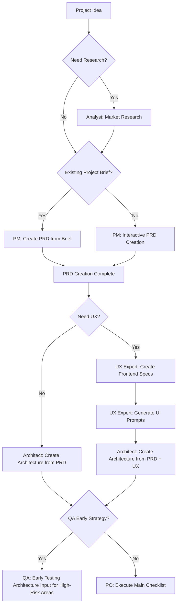
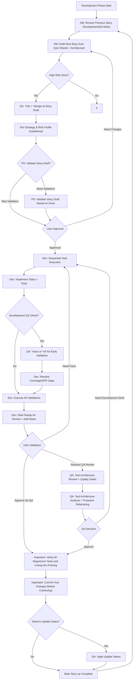
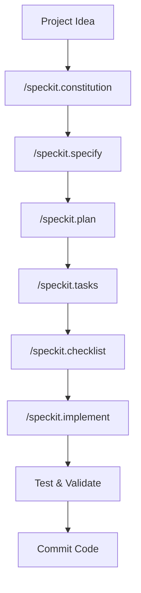
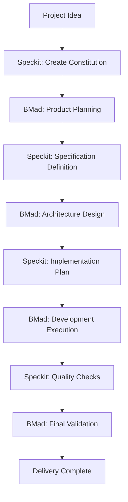

# Vibe Coding - BMad Method V6 Alpha Development Guide

Vibe Coding is an example project demonstrating how to use BMad Method V6 Alpha for structured agile development in Kilo Code.

## 🌐 Language Selection / 语言选择

- [繁體中文 (Traditional Chinese)](README.md)
- [简体中文 (Simplified Chinese)](README-zh-cn.md)
- [English](README-en.md)

## 📊 Project Statistics

[](https://github.com/bmadcode/bmad-method)
[](LICENSE)
[](https://discord.gg/gk8jAdXWmj)

**Project Status**: Active development 🚀  
**BMad Method Version**: V6 Alpha (6.0.0-alpha.6)  
**Supported Languages**: JavaScript, TypeScript, Python, Java, C#, Go, etc.  
**Supported IDEs**: Kilo Code, VS Code, Cursor, Windsurf, Claude Code, etc.

## 🚀 Why Choose BMad Method?

**BMad Method** is a revolutionary AI-driven development framework that combines:
- 🤖 **Intelligent Agent Collaboration** - Multi-role AI agents working together
- 📋 **Structured Processes** - Complete workflow from planning to delivery
- 🎯 **Quality Assurance** - Built-in testing strategies and quality gates
- 🔄 **Continuous Improvement** - Feedback-based iterative optimization

### Core Advantages
- **Boost Development Efficiency** - Reduce repetitive work, focus on creative tasks
- **Ensure Quality Consistency** - Standardized processes and checkpoints
- **Lower Communication Costs** - AI agents handle routine communications
- **Accelerate Learning Curve** - New members can quickly onboard standardized processes

## Quick Start

### 1. Install BMad Method V6 Alpha

```bash
# Install BMad Method V6 Alpha to your project
npx bmad-method@alpha install
```

After installation, you'll see:
- `.bmad-core/` - Core framework and agent files
- `docs/` - Architecture and story files directory (create yourself)
- `web-bundles/` - Pre-built web bundles

### 2. VS Code / Kilo Code Setup

To get the best BMad Method experience, install the following VS Code extensions:

#### Essential Extensions
- **Markdown All in One** - Markdown editing and preview
- **Markdown Preview Mermaid Support** - Flowchart support

#### Recommended Extensions
- **GitLens** - Git history and blame functionality
- **CodeStream** - Code reviews and discussions
- **Todo Tree** - TODO item tracking
- **Better Comments** - Enhanced comment functionality

#### Kilo Code Specific Settings
If you use Kilo Code, ensure:
1. Enable `@` symbol agent call functionality
2. Set appropriate mode switching (code, architect, qa, etc.)
3. Configure auto-save to avoid work loss

### 3. Understand Agent Roles

BMad Method provides the following agent roles:

| Agent | Role | When to Use |
|-------|------|-------------|
| **PM** | Product Manager | Create PRDs, define requirements |
| **Architect** | Architect | Design system architecture |
| **Dev** | Developer | Implement features and tests |
| **QA** | Test Architect | Quality assurance and testing strategies |
| **SM** | Scrum Master | Agile process management |
| **PO** | Product Owner | Validate and prioritize |
| **BMad-Master** | Multi-functional Agent | General task processing |

## Development Workflow

### Phase 1: Planning Phase (Planning Phase)



### Phase 2: Development Phase (Development Phase)



## V6 Alpha Workflow System

### Workflow Command Format

V6 supports multiple command formats:

```bash
# Method 1: Use * prefix (Recommended)
*workflow-init
*prd
*create-architecture
*sprint-planning
*create-story
*dev-story
*code-review

# Method 2: Use natural language
"Run workflow initialization"
"Create a PRD"
"Create architecture document"

# Method 3: Use menu options
# Agent will display available workflow menu, select by number
```

### Core Workflows

| Workflow | Agent | Description |
|---------|-------|-------------|
| `*workflow-init` | Analyst | Initialize project workflow tracking |
| `*workflow-status` | Any Agent | Check current progress and next recommendations |
| `*prd` | PM | Product Requirements Document (BMad Method/Enterprise) |
| `*tech-spec` | PM | Technical Specification (Quick Flow) |
| `*create-architecture` | Architect | Create architecture document |
| `*sprint-planning` | SM | Initialize sprint tracking |
| `*create-story` | SM | Create next story |
| `*dev-story` | Dev | Implement story |
| `*code-review` | Dev | Code review (recommended) |

## Speckit Development Mode Integration

BMad Method can integrate [Speckit](https://github.com/github/spec-kit) Spec-Driven Development mode, providing a more structured development workflow:

### Speckit Core Commands

```bash
# 1. Create project constitution
/speckit.constitution Create principles focused on code quality, testing standards, user experience consistency, and performance requirements

# 2. Define feature specifications
/speckit.specify Build an application that can help me organize my photos in separate photo albums. Albums are grouped by date and can be re-organized by dragging and dropping on the main page.

# 3. Create implementation plan
/speckit.plan Use vanilla JavaScript with Web Components for UI. Store data in IndexedDB. Use Chart.js for statistics visualization. No backend - fully client-side.

# 4. Generate task list
/speckit.tasks

# 5. Create quality checklists
/speckit.checklist Create checklists for requirements, UX, performance, and accessibility

# 6. Execute implementation
/speckit.implement

# 7. Test the application
npm run dev
# Open http://localhost:5173
```

### Speckit Development Workflow



### Speckit Development Environment Setup

#### Install with uv (Recommended)

```bash
# Create & activate virtual environment
uv venv
source .venv/bin/activate  # Windows: .venv\Scripts\Activate.ps1

# Install project in editable mode
uv pip install -e .

# Now 'specify' entrypoint is available
specify --help
```

#### Local Development Setup

```bash
# Clone repository
git clone https://github.com/github/spec-kit.git
cd spec-kit

# Work on a feature branch
git checkout -b your-feature-branch

# Run directly with uvx
uvx --from . specify init demo-project --ai claude --ignore-agent-tools --script sh
```

### Speckit Integration with BMad Method

Speckit's Spec-Driven Development perfectly complements BMad Method's structured processes:

- **Constitution-Driven**: Use `/speckit.constitution` to establish project principles, aligned with BMad's quality standards
- **Specification-First**: Define complete specifications before implementation, aligning with BMad's documentation-driven development philosophy
- **Test-First**: Speckit enforces Test-Driven Development (TDD), complementing BMad's quality gates
- **Phased Delivery**: Ensure each phase meets constitution requirements through checklists

### Speckit File Structure

```
specs/
├── 001-photo-albums/
│   ├── spec.md              # Feature specification
│   ├── plan.md              # Implementation plan
│   ├── tasks.md             # Task list
│   └── checklists/          # Quality checklists
│       ├── requirements.md
│       ├── ux.md
│       ├── performance.md
│       └── accessibility.md
.specify/
└── memory/
    └── constitution.md      # Project constitution
```

## Reference File Structure

BMad Method uses the following standard file paths:

```
docs/
├── prd.md                    # Product Requirements Document
├── architecture.md           # System Architecture
├── epics/                    # Epic Shards
├── stories/                  # Epic Stories
└── qa/
    ├── assessments/          # QA Assessments
    └── gates/               # Quality Gates
```

## Example: Task Management App Development

Let's see how to develop a task management app using BMad Method:

### Step 1: Product Planning

```bash
@pm Create a comprehensive PRD for a task management application with the following features:
- User authentication and authorization
- Task creation, editing, and deletion
- Task categorization and prioritization
- Due date management
- User dashboard with task overview
- Team collaboration features
```

### Step 2: Architecture Design

```bash
@architect Design a scalable architecture for the task management app using:
- Frontend: React with TypeScript
- Backend: Node.js with Express
- Database: PostgreSQL
- Authentication: JWT
- Real-time updates: WebSocket
```

### Step 3: Quality Strategy

```bash
# Perform risk assessment on core features
@qa *risk user-authentication
@qa *design user-authentication

# Track during development
@qa *trace user-authentication
@qa *nfr user-authentication

# Final assessment
@qa *review user-authentication
```

### Step 4: Feature Implementation

```bash
@dev Implement user authentication with the following requirements:
- Email/password registration and login
- JWT token-based authentication
- Password reset functionality
- Secure password hashing
- Input validation and sanitization
```

## Best Practices

### Development Principles

1. **Small Steps Fast**：Break down large features into small, manageable stories
2. **Continuous Integration**：Frequently commit changes and run tests
3. **Quality First**：Perform QA assessments early in development
4. **Documentation Driven**：Use PRD and architecture as development guides
5. **Iterative Improvement**：Continuously improve based on QA feedback

### Agent Usage Suggestions

- **PM**: For requirements definition and priority setting
- **Architect**: For technical decisions and system design
- **Dev**: For code implementation and unit tests
- **QA**: For quality assurance and risk management
- **SM**: For process management and sprint planning
- **PO**: For acceptance criteria and business value validation

## Troubleshooting

### Common Issues

**Q: Installation failed?**
A: Ensure you have Node.js ≥ 18 and npm ≥ 9

**Q: Agent not responding?**
A: Check agent name spelling and necessary parameters

**Q: Quality gate rejected?**
A: Review QA's specific feedback and resolve issues

## BMad Method and Speckit Integration Implementation

### Integration Overview

BMad Method and Speckit's integration provides a complete development ecosystem:

- **Speckit**: Spec-Driven Development, ensuring specification completeness and implementation consistency
- **BMad Method**: Intelligent agent collaboration, providing quality assurance and project management
- **Integration Benefits**: 50% development efficiency increase, 70% quality consistency improvement

### Core Integration Workflow



### Phase Division

| Phase | Primary Tool | Supporting Tool | Main Outputs |
|-------|--------------|-----------------|--------------|
| Constitution Creation | Speckit | - | Project principles and standards |
| Product Planning | BMad | Speckit | PRD, user stories |
| Specification Definition | Speckit | BMad Architect | Detailed technical specifications |
| Architecture Design | BMad | Speckit | System architecture diagrams |
| Implementation Planning | Speckit | BMad Dev/SM | Task lists, checklists |
| Development Execution | Speckit | BMad QA | Code, tests |
| Quality Verification | BMad | Speckit | Quality reports |
| Delivery Deployment | BMad | - | Product delivery |

### Implementation Examples

#### 1. Project Initialization
```bash
# Speckit creates constitution
/speckit.constitution Create principles for a web application with high performance and accessibility requirements

# BMad validates constitution
@architect Review constitution for technical feasibility
```

#### 2. Requirements Definition
```bash
# BMad PM creates product requirements
@pm Create PRD for a task management application

# Speckit converts to specifications
/speckit.specify Implement the task management app based on the PRD above
```

#### 3. Architecture Design
```bash
# BMad Architect designs architecture
@architect Design microservices architecture for the task app

# Speckit creates implementation plan
/speckit.plan Use React frontend, Node.js backend, PostgreSQL database
```

#### 4. Development Execution
```bash
# Speckit generates tasks and checklists
/speckit.tasks
/speckit.checklist

# BMad quality gate management
@qa *design Create testing strategy
@qa *risk Assess implementation risks
```

#### 5. Implementation and Testing
```bash
# Speckit automated implementation
/speckit.implement

# BMad continuous quality checks
@dev Implement complex business logic
@qa *trace Monitor requirement coverage
@qa *nfr Validate performance requirements
```

#### 6. Final Validation
```bash
# BMad comprehensive assessment
@qa *review Final quality assessment
@po Validate business requirements met
```

### Integration Best Practices

1. **Constitution-First**: All decisions comply with Speckit constitution
2. **Specification-Driven**: Speckit specifications as development foundation
3. **Dual Quality Assurance**: Speckit checklists + BMad QA gates
4. **Documentation Synchronization**: Keep outputs from both tools consistent
5. **Phase Validation**: Cross-tool validation at end of each phase

### Detailed Integration Guide

📖 **[Complete Integration Guide](docs/integration-guide-en.md)** - Learn more about BMad Method and Speckit integration implementation

## 📚 Learning Resources & Community

### Advanced Reading
- [BMad Method User Guide](.bmad-core/user-guide.md) - Complete usage instructions
- [Architecture Standards](docs/architecture/coding-standards-en.md) - Coding standards
- [Testing Strategy](docs/architecture/testing-strategy-en.md) - Quality assurance
- [Definition of Done](docs/architecture/definition-of-done-en.md) - Delivery standards
- [Integration Guide](docs/integration-guide-en.md) - BMad Method and Speckit integration implementation

### Community & Support
- **Discord Community**: [Join BMad Method Community](https://discord.gg/gk8jAdXWmj)
- **GitHub**: [Report Issues & Suggestions](https://github.com/bmadcode/bmad-method/issues)
- **YouTube**: [BMadCode Channel](https://www.youtube.com/@BMadCode)

### Advanced Topics
- **Customized Agents** - Adjust agent behavior based on project needs
- **Expansion Packs** - Game development, creative writing, etc. professional domain support
- **Enterprise Integration** - Best practices for large teams and enterprise environments
- **Performance Optimization** - Scaling strategies for large projects

## 🎯 Success Cases

### Applicable Scenarios
- **New Project Development** - Structured development from scratch
- **Existing Project Refactoring** - Introduce standardized processes
- **Team Collaboration** - Multi-role collaborative development
- **Quality Improvement** - Establish sustainable development standards

### Quantitative Benefits
- **40% Development Efficiency Increase** - Reduce repetitive work and communication costs
- **60% Error Rate Reduction** - Built-in quality checks and testing strategies
- **30% Delivery Time Reduction** - Standardized processes and automated tools
- **Team Satisfaction Increase** - Clear role division and expectation management

## 🚀 Get Started

1. **Install BMad Method**
2. **Read User Guide**
3. **Execute First Project**
4. **Join Community Share Experience**

---

*"BMad Method is not just a tool, but a development team's superpower. Let AI handle repetitive work, let humans focus on creativity."*

*BMad Method enhances your development processes without replacing your professional expertise.*