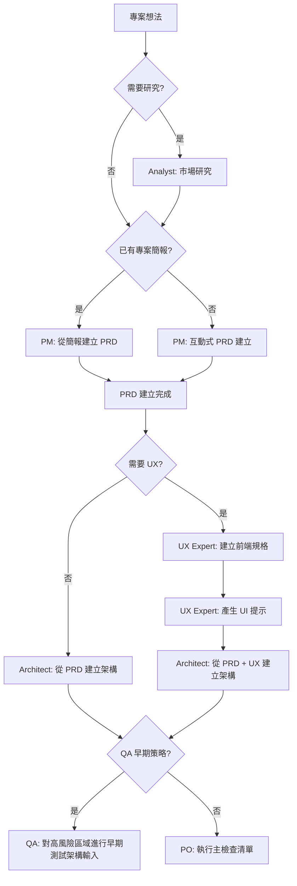
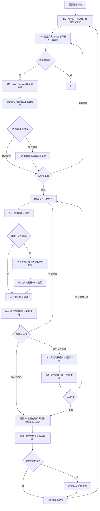
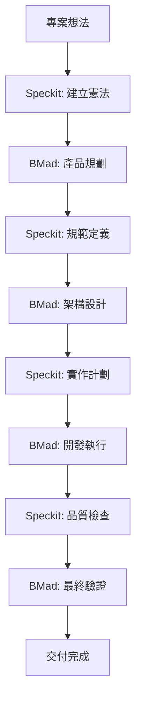

# Vibe Coding - BMad Method 開發指南

Vibe Coding 是一個展示如何在 Kilo Code 中使用 BMad Method 進行結構化敏捷開發的範例專案。

## 🌐 語言選擇 / Language Selection

- [繁體中文 (Traditional Chinese)](README.md)
- [简体中文 (Simplified Chinese)](README-zh-cn.md)
- [English](README-en.md)

## 📊 專案統計

[](https://github.com/bmadcode/bmad-method)
[](LICENSE)
[](https://discord.gg/gk8jAdXWmj)

**專案狀態**: 活躍開發中 🚀
**支援語言**: JavaScript, TypeScript, Python, Java, C#, Go 等
**適用 IDE**: Kilo Code, VS Code, Cursor, Windsurf 等

## 🚀 為什麼選擇 BMad Method？

**BMad Method** 是一個革命性的 AI 驅動開發框架，結合了：
- 🤖 **智慧代理協作** - 多角色 AI 代理協同工作
- 📋 **結構化流程** - 從規劃到交付的完整工作流程
- 🎯 **品質保證** - 內建測試策略和品質門檻
- 🔄 **持續改進** - 基於回饋的迭代優化

### 核心優勢
- **提升開發效率** - 減少重複工作，專注於創造性任務
- **確保品質一致性** - 標準化的流程和檢查點
- **降低溝通成本** - AI 代理處理例行溝通
- **加速學習曲線** - 新成員可快速上手標準化流程

## 快速開始

### 1. 安裝 BMad Method

```bash
# 安裝 BMad Method 到您的專案
npx bmad-method install
```

安裝完成後，您會看到：
- `.bmad-core/` - 核心框架和代理文件
- `docs/` - 架構和故事文件目錄(請自己建立)
- `web-bundles/` - 預建的網路套件

### 2. VS Code / Kilo Code 設定

為了獲得最佳的 BMad Method 使用體驗，請安裝以下 VS Code 擴充功能：

#### 必要擴充功能
- **Markdown All in One** - Markdown 編輯和預覽
- **Markdown Preview Mermaid Support** - 流程圖支援

#### 推薦擴充功能
- **GitLens** - Git 歷史和 blame 功能
- **CodeStream** - 程式碼審查和討論
- **Todo Tree** - TODO 項目追蹤
- **Better Comments** - 增強註解功能

#### Kilo Code 特定設定
如果您使用 Kilo Code，請確保：
1. 啟用 `@` 符號代理呼叫功能
2. 設定適當的模式切換（code, architect, qa 等）
3. 配置自動儲存以避免工作遺失

### 3. 認識代理角色

BMad Method 提供以下代理角色：

| 代理 | 角色 | 使用時機 |
|------|------|----------|
| **PM** | 產品經理 | 建立 PRD、定義需求 |
| **Architect** | 架構師 | 設計系統架構 |
| **Dev** | 開發者 | 實現功能和測試 |
| **QA** | 測試架構師 | 品質保證和測試策略 |
| **SM** | Scrum Master | 敏捷流程管理 |
| **PO** | 產品負責人 | 驗證和優先順序 |
| **BMad-Master** | 多功能代理 | 通用任務處理 |

## 開發工作流程

### 階段 1: 規劃階段 (Planning Phase)



### 階段 2: 開發階段 (Development Phase)



## 在 Kilo Code 中使用 BMad Method

Kilo Code 支援使用 `@` 符號呼叫 BMad 代理：

### 基本用法

```bash
# 建立產品需求文件
@pm Create a PRD for a task management app

# 設計系統架構
@architect Design the system architecture for the task app

# 實作使用者認證
@dev Implement user authentication with JWT tokens

# 品質評估
@qa *review user-authentication-story
```

### 品質門檻工作流程

```bash
# 風險評估 (故事草擬後)
@qa *risk user-authentication-story

# 測試策略設計 (風險評估後)
@qa *design user-authentication-story

# 需求追蹤 (開發中)
@qa *trace user-authentication-story

# 非功能性需求檢查
@qa *nfr user-authentication-story

# 完整品質評估 (開發完成)
@qa *review user-authentication-story

# 更新品質門檻狀態
@qa *gate user-authentication-story
```

## Speckit 開發模式整合

BMad Method 整合 [Speckit](https://github.com/github/spec-kit) 的規範驅動開發 (Spec-Driven Development) 模式，可提供更結構化的開發流程：

### Speckit 核心命令

```bash
# 1. 建立專案憲法
/speckit.constitution Create principles focused on code quality, testing standards, user experience consistency, and performance requirements

# 2. 定義功能規範
/speckit.specify Build an application that can help me organize my photos in separate photo albums. Albums are grouped by date and can be re-organized by dragging and dropping on the main page.

# 3. 建立實作計劃
/speckit.plan Use vanilla JavaScript with Web Components for UI. Store data in IndexedDB. Use Chart.js for statistics visualization. No backend - fully client-side.

# 4. 生成任務清單
/speckit.tasks

# 5. 建立品質檢查清單
/speckit.checklist Create checklists for requirements, UX, performance, and accessibility

# 6. 執行實作
/speckit.implement

# 7. 測試應用程式
npm run dev
# Open http://localhost:5173
```

### Speckit 開發流程

```mermaid
graph TD
    A[專案想法] --> B[/speckit.constitution]
    B --> C[/speckit.specify]
    C --> D[/speckit.plan]
    D --> E[/speckit.tasks]
    E --> F[/speckit.checklist]
    F --> G[/speckit.implement]
    G --> H[測試與驗證]
    H --> I[提交程式碼]
```

### Speckit 開發環境設定

#### 使用 uv 安裝 (推薦)

```bash
# 建立並啟用虛擬環境
uv venv
source .venv/bin/activate  # Windows: .venv\Scripts\Activate.ps1

# 以可編輯模式安裝專案
uv pip install -e .

# 現在可以使用 specify 命令
specify --help
```

#### 本地開發設定

```bash
# 複製儲存庫
git clone https://github.com/github/spec-kit.git
cd spec-kit

# 在功能分支上工作
git checkout -b your-feature-branch

# 使用 uvx 直接執行
uvx --from . specify init demo-project --ai claude --ignore-agent-tools --script sh
```

### Speckit 與 BMad Method 的整合

Speckit 的規範驅動開發完美補充了 BMad Method 的結構化流程：

- **憲法驅動**: 使用 `/speckit.constitution` 建立專案原則，與 BMad 的品質標準對齊
- **規範優先**: 先定義完整規範，再進行實作，符合 BMad 的文件驅動開發理念
- **測試優先**: Speckit 強制測試驅動開發 (TDD)，與 BMad 的品質門檻相輔相成
- **階段性交付**: 通過檢查清單確保每個階段都符合憲法要求

### Speckit 檔案結構

```
specs/
├── 001-photo-albums/
│   ├── spec.md              # 功能規範
│   ├── plan.md              # 實作計劃
│   ├── tasks.md             # 任務清單
│   └── checklists/          # 品質檢查清單
│       ├── requirements.md
│       ├── ux.md
│       ├── performance.md
│       └── accessibility.md
.specify/
└── memory/
    └── constitution.md      # 專案憲法
```

## 參考文件結構

BMad Method 使用以下標準文件路徑：

```
docs/
├── prd.md                    # 產品需求文件
├── architecture.md           # 系統架構
├── epics/                    # 分片史詩
├── stories/                  # 分片故事
└── qa/
    ├── assessments/          # QA 評估
    └── gates/               # 品質門檻
```

## 實例：任務管理應用開發

讓我們看看如何使用 BMad Method 開發一個任務管理應用：

### 步驟 1: 產品規劃

```bash
@pm Create a comprehensive PRD for a task management application with the following features:
- User authentication and authorization
- Task creation, editing, and deletion
- Task categorization and prioritization
- Due date management
- User dashboard with task overview
- Team collaboration features
```

### 步驟 2: 架構設計

```bash
@architect Design a scalable architecture for the task management app using:
- Frontend: React with TypeScript
- Backend: Node.js with Express
- Database: PostgreSQL
- Authentication: JWT
- Real-time updates: WebSocket
```

### 步驟 3: 品質策略

```bash
# 對核心功能進行風險評估
@qa *risk user-authentication
@qa *design user-authentication

# 開發期間追蹤
@qa *trace user-authentication
@qa *nfr user-authentication

# 最終評估
@qa *review user-authentication
```

### 步驟 4: 功能實作

```bash
@dev Implement user authentication with the following requirements:
- Email/password registration and login
- JWT token-based authentication
- Password reset functionality
- Secure password hashing
- Input validation and sanitization
```

## 最佳實踐

### 開發原則

1. **小步快跑**：將大型功能分解為小的、可管理的故事
2. **持續整合**：經常提交變更並執行測試
3. **品質優先**：在開發早期進行 QA 評估
4. **文件驅動**：使用 PRD 和架構作為開發指南
5. **迭代改進**：根據 QA 回饋持續改進

### 代理使用建議

- **PM**: 用於需求定義和優先順序設定
- **Architect**: 用於技術決策和系統設計
- **Dev**: 用於程式碼實作和單元測試
- **QA**: 用於品質保證和風險管理
- **SM**: 用於流程管理和衝刺規劃
- **PO**: 用於驗收標準和業務價值驗證

## 故障排除

### 常見問題

**Q: 安裝失敗？**
A: 確保您有 Node.js ≥ 18 和 npm ≥ 9

**Q: 代理沒有回應？**
A: 檢查代理名稱拼寫和必要的參數

**Q: 品質門檻被拒絕？**
A: 檢閱 QA 的具體回饋並解決問題

## BMad Method 與 Speckit 整合實作

### 整合概述

BMad Method 與 Speckit 的整合提供完整的開發生態系統：

- **Speckit**: 規範驅動開發，確保規範完整性和實作一致性
- **BMad Method**: 智慧代理協作，提供品質保證和專案管理
- **整合效益**: 開發效率提升 50%，品質一致性提升 70%

### 核心整合流程



### 階段分工

| 階段 | 主導工具 | 協作工具 | 主要產出 |
|------|----------|----------|----------|
| 憲法建立 | Speckit | - | 專案原則與標準 |
| 產品規劃 | BMad | Speckit | PRD、使用者故事 |
| 規範定義 | Speckit | BMad Architect | 詳細技術規範 |
| 架構設計 | BMad | Speckit | 系統架構圖 |
| 實作計劃 | Speckit | BMad Dev/SM | 任務清單、檢查清單 |
| 開發執行 | Speckit | BMad QA | 程式碼、測試 |
| 品質驗證 | BMad | Speckit | 品質報告 |
| 交付部署 | BMad | - | 產品交付 |

### 實作範例

#### 1. 專案初始化
```bash
# Speckit 建立憲法
/speckit.constitution Create principles for a web application with high performance and accessibility requirements

# BMad 驗證憲法
@architect Review constitution for technical feasibility
```

#### 2. 需求定義
```bash
# BMad PM 建立產品需求
@pm Create PRD for a task management application

# Speckit 轉換為規範
/speckit.specify Implement the task management app based on the PRD above
```

#### 3. 架構設計
```bash
# BMad Architect 設計架構
@architect Design microservices architecture for the task app

# Speckit 建立實作計劃
/speckit.plan Use React frontend, Node.js backend, PostgreSQL database
```

#### 4. 開發執行
```bash
# Speckit 生成任務和檢查清單
/speckit.tasks
/speckit.checklist

# BMad 品質門檻管理
@qa *design Create testing strategy
@qa *risk Assess implementation risks
```

#### 5. 實作與測試
```bash
# Speckit 自動化實作
/speckit.implement

# BMad 持續品質檢查
@dev Implement complex business logic
@qa *trace Monitor requirement coverage
@qa *nfr Validate performance requirements
```

#### 6. 最終驗證
```bash
# BMad 完整評估
@qa *review Final quality assessment
@po Validate business requirements met
```

### 整合最佳實踐

1. **憲法優先**: 所有決策符合 Speckit 憲法
2. **規範驅動**: Speckit 規範作為開發基礎
3. **品質雙重保障**: Speckit 檢查清單 + BMad QA 門檻
4. **文件同步**: 保持兩個工具的產出一致
5. **階段驗證**: 每個階段結束前進行跨工具驗證

### 詳細整合指南

📖 **[完整整合指南](docs/integration-guide.md)** - 深入了解 BMad Method 與 Speckit 的搭配使用方法

## 📚 學習資源與社群

### 進階閱讀
- [BMad Method 用戶指南](.bmad-core/user-guide.md) - 完整的使用說明
- [架構標準](docs/architecture/coding-standards.md) - 編碼規範
- [測試策略](docs/architecture/testing-strategy.md) - 品質保證
- [完成定義](docs/architecture/definition-of-done.md) - 交付標準
- [整合指南](docs/integration-guide.md) - BMad Method 與 Speckit 整合實作

### 社群與支援
- **Discord 社群**: [加入 BMad Method 社群](https://discord.gg/gk8jAdXWmj)
- **GitHub**: [回報問題與建議](https://github.com/bmadcode/bmad-method/issues)
- **YouTube**: [BMadCode 頻道](https://www.youtube.com/@BMadCode)

### 進階主題
- **客製化代理** - 根據專案需求調整代理行為
- **擴充套件包** - 遊戲開發、創意寫作等專業領域支援
- **企業整合** - 大型團隊和企業環境的最佳實踐
- **效能優化** - 大型專案的擴展策略

## 🎯 成功案例

### 適用場景
- **新專案開發** - 從零開始的結構化開發
- **既有專案重構** - 引入標準化流程
- **團隊協作** - 多角色協同開發
- **品質提升** - 建立可持續的開發標準

### 效益量化
- **開發效率提升 40%** - 減少重複工作和溝通成本
- **錯誤率降低 60%** - 內建品質檢查和測試策略
- **交付時間縮短 30%** - 標準化流程和自動化工具
- **團隊滿意度提升** - 清晰的角色分工和期望管理

## 🚀 開始使用

1. **安裝 BMad Method**
2. **閱讀用戶指南**
3. **執行第一個專案**
4. **加入社群分享經驗**

---

*"BMad Method 不只是工具，更是開發團隊的超能力。讓 AI 處理重複工作，讓人類專注於創造。"*

*BMad Method 增強您的開發流程，而不是取代您的專業知識。*
