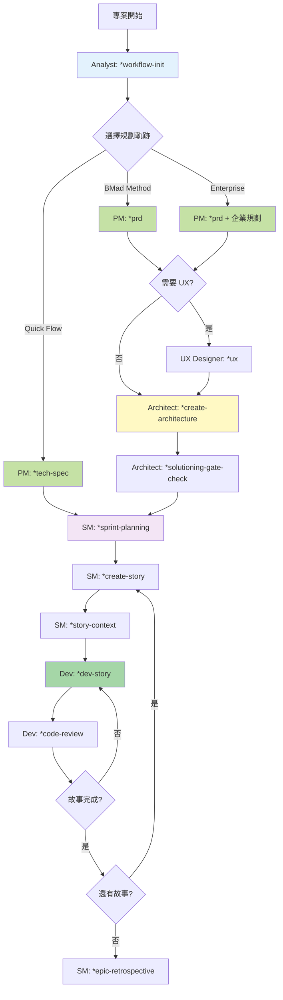
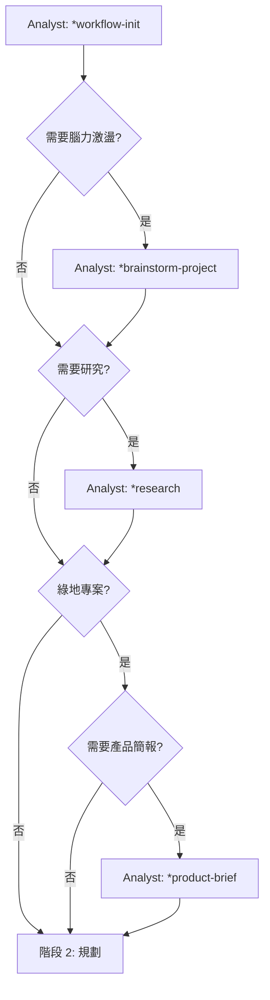
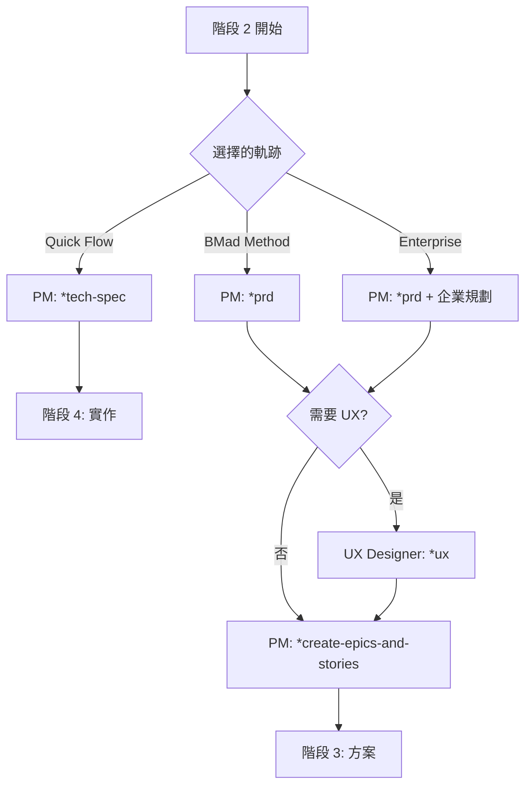
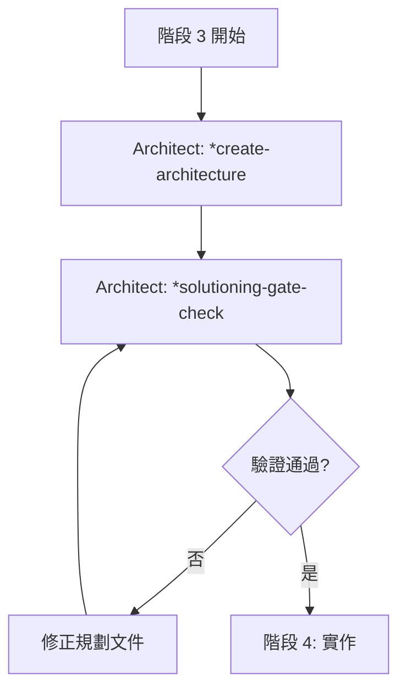
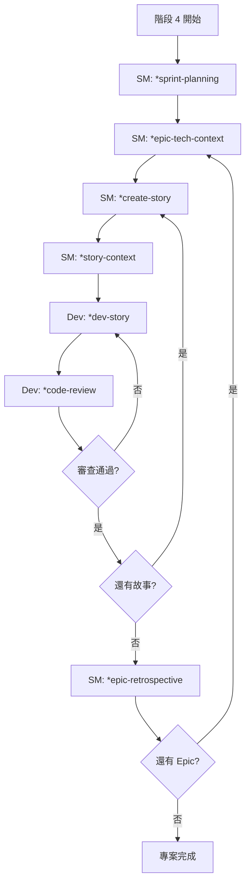

# Vibe Coding - BMad Method V6 Alpha 開發指南

Vibe Coding 是一個展示如何在 Kilo Code 中使用 BMad Method V6 Alpha 進行結構化敏捷開發的範例專案。

## 🌐 語言選擇 / Language Selection

- [繁體中文 (Traditional Chinese)](README.md)
- [简体中文 (Simplified Chinese)](README-zh-cn.md)
- [English](README-en.md)

## 📊 專案統計

[](https://github.com/bmadcode/bmad-method)
[](LICENSE)
[](https://discord.gg/gk8jAdXWmj)
[](https://github.com/bmad-code-org/BMAD-METHOD)

**專案狀態**: 活躍開發中 🚀  
**BMad Method 版本**: V6 Alpha (6.0.0-alpha.6)  
**支援語言**: JavaScript, TypeScript, Python, Java, C#, Go 等  
**適用 IDE**: Kilo Code, VS Code, Cursor, Windsurf, Claude Code 等

## 🚀 為什麼選擇 BMad Method V6？

**BMad Method V6 Alpha** 是一個革命性的 AI 驅動開發框架，結合了：
- 🤖 **智慧代理協作** - 多角色 AI 代理協同工作
- 📋 **結構化工作流程系統** - 全新的互動式工作流程（Workflow）取代舊版任務（Tasks）
- 🎯 **品質保證** - 內建測試策略和品質門檻
- 🔄 **持續改進** - 基於回饋的迭代優化
- 🎨 **規模自適應** - 自動根據專案複雜度調整規劃深度

### V6 Alpha 核心新特性

- **工作流程系統** - 使用互動式工作流程取代舊版任務和模板
- **簡化指令** - 使用 `*workflow-name` 或自然語言啟動工作流程
- **自動追蹤** - `workflow-init` 自動建立專案追蹤，`workflow-status` 隨時查看進度
- **三種規劃軌跡** - Quick Flow、BMad Method、Enterprise Method
- **上下文管理** - 建議每個工作流程使用新對話，避免上下文限制

### 核心優勢

- **提升開發效率** - 減少重複工作，專注於創造性任務
- **確保品質一致性** - 標準化的流程和檢查點
- **降低溝通成本** - AI 代理處理例行溝通
- **加速學習曲線** - 新成員可快速上手標準化流程

## 快速開始

### 1. 安裝 BMad Method V6 Alpha

```bash
# 安裝 BMad Method V6 Alpha 到您的專案
npx bmad-method@alpha install
```

安裝完成後，您會看到：
- `bmad/` - 核心框架、代理和工作流程文件
- `docs/` - 架構和故事文件目錄（自動建立）
- `.cursor/rules/bmad/` - Cursor IDE 規則文件（如果使用 Cursor）

### 2. VS Code / Kilo Code / Cursor 設定

為了獲得最佳的 BMad Method V6 使用體驗，請安裝以下 VS Code 擴充功能：

#### 必要擴充功能
- **Markdown All in One** - Markdown 編輯和預覽
- **Markdown Preview Mermaid Support** - 流程圖支援

#### 推薦擴充功能
- **GitLens** - Git 歷史和 blame 功能
- **CodeStream** - 程式碼審查和討論
- **Todo Tree** - TODO 項目追蹤
- **Better Comments** - 增強註解功能

#### IDE 特定設定

**Kilo Code:**
- 啟用 `@` 符號代理呼叫功能
- 設定適當的模式切換（code, architect, qa 等）
- 配置自動儲存以避免工作遺失

**Cursor:**
- BMad Method 規則已自動安裝到 `.cursor/rules/bmad/`
- 使用 `@bmad/` 前綴引用特定代理或工作流程

**Claude Code:**
- 參考 [Claude Code 設定指南](bmad/docs/ide-info/claude-code.md)

### 3. 認識代理角色

BMad Method V6 提供以下代理角色：

| 代理 | 角色 | 主要工作流程 | 使用時機 |
|------|------|------------|----------|
| **Analyst** | 分析師 | `*workflow-init`, `*workflow-status`, `*brainstorm-project`, `*research` | 專案初始化、進度追蹤、研究和腦力激盪 |
| **PM** | 產品經理 | `*prd`, `*tech-spec`, `*create-epics-and-stories` | 建立 PRD、技術規格、Epic 和故事 |
| **Architect** | 架構師 | `*create-architecture`, `*solutioning-gate-check` | 設計系統架構、驗證方案完整性 |
| **SM** | Scrum Master | `*sprint-planning`, `*create-story`, `*story-context`, `*epic-retrospective` | 衝刺規劃、故事管理、回顧 |
| **Dev** | 開發者 | `*dev-story`, `*code-review` | 實作功能、程式碼審查 |
| **UX Designer** | UX 設計師 | `*ux` | 建立 UX 設計文件 |
| **TEA** | 測試架構師 | 測試策略和品質保證 | 品質保證和測試策略 |
| **Technical Writer** | 技術文件撰寫 | 文件生成 | 技術文件撰寫 |

### 4. 初始化工作流程

**重要：每個工作流程建議使用新對話，以避免上下文限制**

```bash
# 1. 載入 Analyst 代理
# 在您的 IDE 中開啟 Analyst 代理文件或使用 @analyst

# 2. 執行工作流程初始化
*workflow-init
# 或使用自然語言："執行工作流程初始化"
```

`workflow-init` 會引導您：
- 描述專案目標
- 選擇專案類型（新專案/既有專案）
- 選擇規劃軌跡（Quick Flow / BMad Method / Enterprise Method）
- 建立 `bmm-workflow-status.yaml` 追蹤文件

## V6 Alpha 工作流程系統

### 工作流程指令格式

V6 支援多種指令格式：

```bash
# 方式 1: 使用 * 前綴（推薦）
*workflow-init
*prd
*create-architecture
*sprint-planning
*create-story
*dev-story
*code-review

# 方式 2: 使用自然語言
"執行工作流程初始化"
"建立 PRD"
"建立架構文件"

# 方式 3: 使用菜單選項
# 代理會顯示可用工作流程選單，選擇編號即可
```

### 核心工作流程

#### 專案管理

| 工作流程 | 代理 | 說明 |
|---------|------|------|
| `*workflow-init` | Analyst | 初始化專案工作流程追蹤 |
| `*workflow-status` | 任何代理 | 查看當前進度和下一步建議 |

#### 規劃階段（Phase 1-2）

| 工作流程 | 代理 | 適用軌跡 | 說明 |
|---------|------|---------|------|
| `*brainstorm-project` | Analyst | 所有 | 專案腦力激盪（可選） |
| `*research` | Analyst | 所有 | 領域研究（可選） |
| `*product-brief` | Analyst | BMad Method/Enterprise | 產品簡報（可選，僅綠地專案） |
| `*prd` | PM | BMad Method/Enterprise | 產品需求文件（Level 2-4） |
| `*tech-spec` | PM | Quick Flow | 技術規格（Level 0-1） |
| `*create-epics-and-stories` | PM | BMad Method/Enterprise | 建立 Epic 和故事 |
| `*ux` | UX Designer | 所有 | UX 設計文件（UI 專案） |

#### 方案階段（Phase 3）

| 工作流程 | 代理 | 適用軌跡 | 說明 |
|---------|------|---------|------|
| `*create-architecture` | Architect | BMad Method/Enterprise | 建立架構文件（Level 3-4 或建議） |
| `*solutioning-gate-check` | Architect | BMad Method/Enterprise | 驗證所有規劃文件一致性 |

#### 實作階段（Phase 4）

| 工作流程 | 代理 | 說明 |
|---------|------|------|
| `*sprint-planning` | SM | 初始化衝刺追蹤（僅執行一次） |
| `*epic-tech-context` | SM | 建立 Epic 技術上下文（每個 Epic） |
| `*create-story` | SM | 建立下一個故事 |
| `*story-context` | SM | 建立故事技術上下文（每個故事，建議） |
| `*dev-story` | Dev | 實作故事 |
| `*code-review` | Dev | 程式碼審查（建議） |
| `*epic-retrospective` | SM | Epic 完成後回顧 |

## 開發工作流程

### 完整開發流程圖



### 階段 1: 分析階段（可選）



### 階段 2: 規劃階段（必要）



### 階段 3: 方案階段（BMad Method/Enterprise）



### 階段 4: 實作階段（必要）



## 在 Kilo Code / Cursor 中使用 BMad Method V6

### 基本用法

```bash
# 初始化工作流程
*workflow-init

# 查看進度
*workflow-status

# 建立產品需求文件
*prd

# 建立技術規格（Quick Flow）
*tech-spec

# 建立架構文件
*create-architecture

# 建立故事
*create-story

# 實作故事
*dev-story

# 程式碼審查
*code-review
```

### 自然語言指令

V6 代理支援自然語言，您也可以這樣說：

```bash
# 自然語言範例
"執行工作流程初始化"
"我想建立一個 PRD"
"幫我建立架構文件"
"開始實作這個故事"
"進行程式碼審查"
```

### 工作流程狀態查詢

隨時使用 `*workflow-status` 查看進度：

```bash
# 載入任何代理後執行
*workflow-status

# 代理會告訴您：
# - 當前階段
# - 已完成的工作流程
# - 下一步建議的工作流程
# - 需要的代理
```

## 規劃軌跡說明

### Quick Flow（快速流程）

**適用場景：** Level 0-1 專案（1-15 個故事）
- 簡單功能、錯誤修復、小變更
- 只需技術規格（tech-spec）
- 跳過架構階段，直接進入實作

**工作流程：**
```
workflow-init → tech-spec → sprint-planning → create-story → dev-story
```

### BMad Method（標準方法）

**適用場景：** Level 2-4 專案（10-50+ 個故事）
- 產品、平台、複雜功能
- 完整規劃：PRD + UX + Architecture
- 推薦給大多數專案

**工作流程：**
```
workflow-init → prd → create-epics-and-stories → ux (可選) → 
create-architecture → solutioning-gate-check → sprint-planning → 
epic-tech-context → create-story → story-context → dev-story → code-review
```

### Enterprise Method（企業方法）

**適用場景：** Level 4 專案（30+ 個故事）
- 企業需求、合規性、多租戶
- BMad Method + 安全架構 + DevOps + 測試策略
- 完整的企業級規劃

**工作流程：**
```
BMad Method 流程 + 企業專用規劃階段
```

## 專案追蹤文件

BMad Method V6 自動建立兩個追蹤文件：

### 1. `docs/bmm-workflow-status.yaml`

追蹤規劃和方案階段的進度：
- 自動由 `workflow-init` 建立
- 記錄所有工作流程的完成狀態
- 使用 `workflow-status` 查看

### 2. `docs/sprint-status.yaml`

追蹤實作階段的進度：
- 自動由 `sprint-planning` 建立
- 記錄所有 Epic 和故事的狀態
- SM 和 Dev 代理使用此文件追蹤進度

**重要：** 這些文件由代理自動更新，通常不需要手動編輯。

## 最佳實踐

### 開發原則

1. **每個工作流程使用新對話** - 避免上下文限制和幻覺
2. **小步快跑** - 將大型功能分解為小的、可管理的故事
3. **持續整合** - 經常提交變更並執行測試
4. **品質優先** - 使用 `code-review` 確保程式碼品質
5. **文件驅動** - 使用 PRD 和架構作為開發指南
6. **定期檢查狀態** - 使用 `workflow-status` 查看進度

### 代理使用建議

- **Analyst**: 專案初始化、進度追蹤、研究和腦力激盪
- **PM**: 需求定義、PRD/技術規格建立、Epic 和故事管理
- **Architect**: 架構設計、方案驗證
- **SM**: 衝刺規劃、故事管理、回顧
- **Dev**: 程式碼實作、程式碼審查
- **UX Designer**: UI/UX 設計文件（UI 專案）

### 工作流程最佳實踐

1. **使用 200k+ 上下文模型** - Claude Sonnet 4.5、GPT-4 等
2. **每個工作流程使用新對話** - 確保最大上下文容量
3. **遵循工作流程順序** - 讓 `workflow-status` 引導您
4. **不要跳過驗證步驟** - `solutioning-gate-check` 和 `code-review` 很重要
5. **定期提交程式碼** - 完成故事後立即提交

## 故障排除

### 常見問題

**Q: 安裝失敗？**  
A: 確保您有 Node.js ≥ 18 和 npm ≥ 9

**Q: 代理沒有回應工作流程指令？**  
A: 
- 檢查指令拼寫（使用 `*workflow-name` 格式）
- 確保已載入正確的代理
- 嘗試使用自然語言或菜單選項

**Q: 工作流程執行失敗？**  
A: 
- 檢查是否在正確的階段執行工作流程
- 使用 `workflow-status` 查看當前狀態
- 確保前置工作流程已完成

**Q: 上下文限制問題？**  
A: 
- 使用新對話執行每個工作流程
- 使用 200k+ 上下文的模型
- 避免在同一對話中執行多個大型工作流程

**Q: 找不到工作流程？**  
A: 
- 使用 `workflow-status` 查看可用工作流程
- 檢查您選擇的規劃軌跡是否支援該工作流程
- 確認代理已正確載入

## 📚 學習資源與社群

### 進階閱讀

- [BMad Method V6 快速開始指南](bmad/bmm/docs/quick-start.md) - 完整的使用說明
- [BMM 完整文件](bmad/bmm/README.md) - 模組詳細說明
- [工作流程文件](bmad/bmm/docs/workflows-planning.md) - 規劃工作流程詳解
- [架構標準](docs/architecture/coding-standards.md) - 編碼規範
- [測試策略](docs/architecture/testing-strategy.md) - 品質保證
- [完成定義](docs/architecture/definition-of-done.md) - 交付標準

### 社群與支援

- **Discord 社群**: [加入 BMad Method 社群](https://discord.gg/gk8jAdXWmj)
- **GitHub**: [回報問題與建議](https://github.com/bmad-code-org/BMAD-METHOD/issues)
- **YouTube**: [BMadCode 頻道](https://www.youtube.com/@BMadCode)

### 進階主題

- **客製化代理** - 根據專案需求調整代理行為
- **擴充套件包** - 遊戲開發、創意寫作等專業領域支援
- **企業整合** - 大型團隊和企業環境的最佳實踐
- **效能優化** - 大型專案的擴展策略

## 🎯 成功案例

### 適用場景

- **新專案開發** - 從零開始的結構化開發
- **既有專案重構** - 引入標準化流程
- **團隊協作** - 多角色協同開發
- **品質提升** - 建立可持續的開發標準

### 效益量化

- **開發效率提升 40%** - 減少重複工作和溝通成本
- **錯誤率降低 60%** - 內建品質檢查和測試策略
- **交付時間縮短 30%** - 標準化流程和自動化工具
- **團隊滿意度提升** - 清晰的角色分工和期望管理

## 🚀 開始使用

1. **安裝 BMad Method V6 Alpha** - `npx bmad-method@alpha install`
2. **執行工作流程初始化** - 載入 Analyst 代理，執行 `*workflow-init`
3. **遵循工作流程指引** - 使用 `*workflow-status` 查看下一步
4. **開始建立** - 按照建議執行各個工作流程

---

*"BMad Method V6 不只是工具，更是開發團隊的超能力。讓 AI 處理重複工作，讓人類專注於創造。"*

*BMad Method 增強您的開發流程，而不是取代您的專業知識。*
