# Vibe Coding - BMad Method 開發指南

Vibe Coding 是一個展示如何在 Kilo Code 中使用 BMad Method 進行結構化敏捷開發的範例專案。

## 🌐 語言選擇 / Language Selection

- [繁體中文 (Traditional Chinese)](README.md)
- [简体中文 (Simplified Chinese)](docs/zh-cn/README.md)
- [English](docs/en/README.md)

## 📊 專案統計

[](https://github.com/bmadcode/bmad-method)
[](LICENSE)
[](https://discord.gg/gk8jAdXWmj)

**專案狀態**: 活躍開發中 🚀
**支援語言**: JavaScript, TypeScript, Python, Java, C#, Go 等
**適用 IDE**: Kilo Code, VS Code, Cursor, Windsurf 等

## 🚀 為什麼選擇 BMad Method？

**BMad Method** 是一個革命性的 AI 驅動開發框架，結合了：
- 🤖 **智慧代理協作** - 多角色 AI 代理協同工作
- 📋 **結構化流程** - 從規劃到交付的完整工作流程
- 🎯 **品質保證** - 內建測試策略和品質門檻
- 🔄 **持續改進** - 基於回饋的迭代優化

### 核心優勢
- **提升開發效率** - 減少重複工作，專注於創造性任務
- **確保品質一致性** - 標準化的流程和檢查點
- **降低溝通成本** - AI 代理處理例行溝通
- **加速學習曲線** - 新成員可快速上手標準化流程

## 快速開始

### 1. 安裝 BMad Method

```bash
# 安裝 BMad Method 到您的專案
npx bmad-method install
```

安裝完成後，您會看到：
- `.bmad-core/` - 核心框架和代理文件
- `docs/` - 架構和故事文件目錄(請自己建立)
- `web-bundles/` - 預建的網路套件

### 2. VS Code / Kilo Code 設定

為了獲得最佳的 BMad Method 使用體驗，請安裝以下 VS Code 擴充功能：

#### 必要擴充功能
- **Markdown All in One** - Markdown 編輯和預覽
- **Markdown Preview Mermaid Support** - 流程圖支援

#### 推薦擴充功能
- **GitLens** - Git 歷史和 blame 功能
- **CodeStream** - 程式碼審查和討論
- **Todo Tree** - TODO 項目追蹤
- **Better Comments** - 增強註解功能

#### Kilo Code 特定設定
如果您使用 Kilo Code，請確保：
1. 啟用 `@` 符號代理呼叫功能
2. 設定適當的模式切換（code, architect, qa 等）
3. 配置自動儲存以避免工作遺失

### 3. 認識代理角色

BMad Method 提供以下代理角色：

| 代理 | 角色 | 使用時機 |
|------|------|----------|
| **PM** | 產品經理 | 建立 PRD、定義需求 |
| **Architect** | 架構師 | 設計系統架構 |
| **Dev** | 開發者 | 實現功能和測試 |
| **QA** | 測試架構師 | 品質保證和測試策略 |
| **SM** | Scrum Master | 敏捷流程管理 |
| **PO** | 產品負責人 | 驗證和優先順序 |
| **BMad-Master** | 多功能代理 | 通用任務處理 |

## 開發工作流程

### 階段 1: 規劃階段 (Planning Phase)

```mermaid
graph TD
    A[專案想法] --> B{需要研究?}
    B -->|是| C[Analyst: 市場研究]
    B -->|否| D{已有專案簡報?}
    C --> D
    D -->|是| E[PM: 從簡報建立 PRD]
    D -->|否| F[PM: 互動式 PRD 建立]
    E --> G[PRD 建立完成]
    F --> G
    G --> H{需要 UX?}
    H -->|是| I[UX Expert: 建立前端規格]
    H -->|否| J[Architect: 從 PRD 建立架構]
    I --> K[UX Expert: 產生 UI 提示]
    K --> L[Architect: 從 PRD + UX 建立架構]
    J --> M{QA 早期策略?}
    L --> M
    M -->|是| N[QA: 對高風險區域進行早期測試架構輸入]
    M -->|否| O[PO: 執行主檢查清單]
```



### 階段 2: 開發階段 (Development Phase)

```mermaid
graph TD
    A[開發階段開始] --> B[SM: 檢閱前一個故事的開發/QA 筆記]
    B --> C[SM: 從分片史詩 + 架構草擬下一個故事]
    C --> D{高風險故事?}
    D -->|是| E[QA: *risk + *design 於草擬故事]
    D -->|否| F
    E --> G[測試策略與風險設定檔已建立]
    G --> H{PO: 驗證故事草擬?}
    H -->|需要驗證| I[PO: 根據成品驗證故事草擬]
    H -->|跳過驗證| J{使用者核准}
    I --> J
    J -->|核准| K[Dev: 循序任務執行]
    J -->|需要變更| C
    K --> L[Dev: 實作任務 + 測試]
    L --> M{開發中 QA 檢查?}
    M -->|是| N[QA: *trace 或 *nfr 用於早期驗證]
    M -->|否| O
    N --> P[Dev: 解決覆蓋/NFR 差距]
    P --> O[Dev: 執行所有驗證]
    O --> Q[Dev: 標記準備檢閱 + 新增筆記]
    Q --> R{使用者驗證}
    R -->|請求 QA 檢閱| S[QA: 測試架構檢閱 + 品質門檻]
    R -->|核准無 QA| U[重要: 驗證所有迴歸測試和 linting 正在通過]
    S --> T[QA: 測試架構分析 + 主動重構]
    T --> V{QA 決定}
    V -->|需要開發工作| K
    V -->|核准| U
    R -->|需要修復| K
    U --> W[重要: 提交您的變更後再繼續!]
    W --> X{需要更新門檻?}
    X -->|是| Y[QA: *gate 更新狀態]
    X -->|否| Z
    Y --> Z[標記故事為完成]
    Z --> B
```



## 在 Kilo Code 中使用 BMad Method

Kilo Code 支援使用 `@` 符號呼叫 BMad 代理：

### 基本用法

```bash
# 建立產品需求文件
@pm Create a PRD for a task management app

# 設計系統架構
@architect Design the system architecture for the task app

# 實作使用者認證
@dev Implement user authentication with JWT tokens

# 品質評估
@qa *review user-authentication-story
```

### 品質門檻工作流程

```bash
# 風險評估 (故事草擬後)
@qa *risk user-authentication-story

# 測試策略設計 (風險評估後)
@qa *design user-authentication-story

# 需求追蹤 (開發中)
@qa *trace user-authentication-story

# 非功能性需求檢查
@qa *nfr user-authentication-story

# 完整品質評估 (開發完成)
@qa *review user-authentication-story

# 更新品質門檻狀態
@qa *gate user-authentication-story
```

## 參考文件結構

BMad Method 使用以下標準文件路徑：

```
docs/
├── prd.md                    # 產品需求文件
├── architecture.md           # 系統架構
├── epics/                    # 分片史詩
├── stories/                  # 分片故事
└── qa/
    ├── assessments/          # QA 評估
    └── gates/               # 品質門檻
```

## 實例：任務管理應用開發

讓我們看看如何使用 BMad Method 開發一個任務管理應用：

### 步驟 1: 產品規劃

```bash
@pm Create a comprehensive PRD for a task management application with the following features:
- User authentication and authorization
- Task creation, editing, and deletion
- Task categorization and prioritization
- Due date management
- User dashboard with task overview
- Team collaboration features
```

### 步驟 2: 架構設計

```bash
@architect Design a scalable architecture for the task management app using:
- Frontend: React with TypeScript
- Backend: Node.js with Express
- Database: PostgreSQL
- Authentication: JWT
- Real-time updates: WebSocket
```

### 步驟 3: 品質策略

```bash
# 對核心功能進行風險評估
@qa *risk user-authentication
@qa *design user-authentication

# 開發期間追蹤
@qa *trace user-authentication
@qa *nfr user-authentication

# 最終評估
@qa *review user-authentication
```

### 步驟 4: 功能實作

```bash
@dev Implement user authentication with the following requirements:
- Email/password registration and login
- JWT token-based authentication
- Password reset functionality
- Secure password hashing
- Input validation and sanitization
```

## 最佳實踐

### 開發原則

1. **小步快跑**：將大型功能分解為小的、可管理的故事
2. **持續整合**：經常提交變更並執行測試
3. **品質優先**：在開發早期進行 QA 評估
4. **文件驅動**：使用 PRD 和架構作為開發指南
5. **迭代改進**：根據 QA 回饋持續改進

### 代理使用建議

- **PM**: 用於需求定義和優先順序設定
- **Architect**: 用於技術決策和系統設計
- **Dev**: 用於程式碼實作和單元測試
- **QA**: 用於品質保證和風險管理
- **SM**: 用於流程管理和衝刺規劃
- **PO**: 用於驗收標準和業務價值驗證

## 故障排除

### 常見問題

**Q: 安裝失敗？**
A: 確保您有 Node.js ≥ 18 和 npm ≥ 9

**Q: 代理沒有回應？**
A: 檢查代理名稱拼寫和必要的參數

**Q: 品質門檻被拒絕？**
A: 檢閱 QA 的具體回饋並解決問題

## 📚 學習資源與社群

### 進階閱讀
- [BMad Method 用戶指南](.bmad-core/user-guide.md) - 完整的使用說明
- [架構標準](docs/architecture/coding-standards.md) - 編碼規範
  - [简体中文版](docs/architecture/zh-cn/coding-standards-zh-cn.md)
  - [English版](docs/architecture/en/coding-standards-en.md)
- [測試策略](docs/architecture/testing-strategy.md) - 品質保證
  - [简体中文版](docs/architecture/zh-cn/testing-strategy-zh-cn.md)
  - [English版](docs/architecture/en/testing-strategy-en.md)
- [完成定義](docs/architecture/definition-of-done.md) - 交付標準
  - [简体中文版](docs/architecture/zh-cn/definition-of-done-zh-cn.md)
  - [English版](docs/architecture/en/definition-of-done-en.md)

### 社群與支援
- **Discord 社群**: [加入 BMad Method 社群](https://discord.gg/gk8jAdXWmj)
- **GitHub**: [回報問題與建議](https://github.com/bmadcode/bmad-method/issues)
- **YouTube**: [BMadCode 頻道](https://www.youtube.com/@BMadCode)

### 進階主題
- **客製化代理** - 根據專案需求調整代理行為
- **擴充套件包** - 遊戲開發、創意寫作等專業領域支援
- **企業整合** - 大型團隊和企業環境的最佳實踐
- **效能優化** - 大型專案的擴展策略

## 🎯 成功案例

### 適用場景
- **新專案開發** - 從零開始的結構化開發
- **既有專案重構** - 引入標準化流程
- **團隊協作** - 多角色協同開發
- **品質提升** - 建立可持續的開發標準

### 效益量化
- **開發效率提升 40%** - 減少重複工作和溝通成本
- **錯誤率降低 60%** - 內建品質檢查和測試策略
- **交付時間縮短 30%** - 標準化流程和自動化工具
- **團隊滿意度提升** - 清晰的角色分工和期望管理

## 🚀 開始使用

1. **安裝 BMad Method**
2. **閱讀用戶指南**
3. **執行第一個專案**
4. **加入社群分享經驗**

---

*"BMad Method 不只是工具，更是開發團隊的超能力。讓 AI 處理重複工作，讓人類專注於創造。"*

*BMad Method 增強您的開發流程，而不是取代您的專業知識。*
