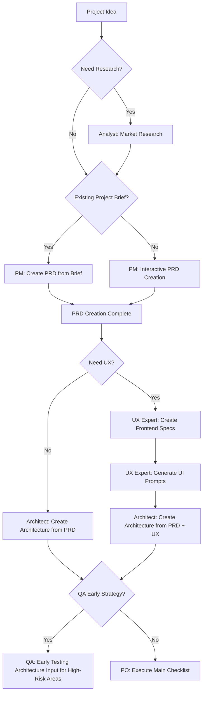
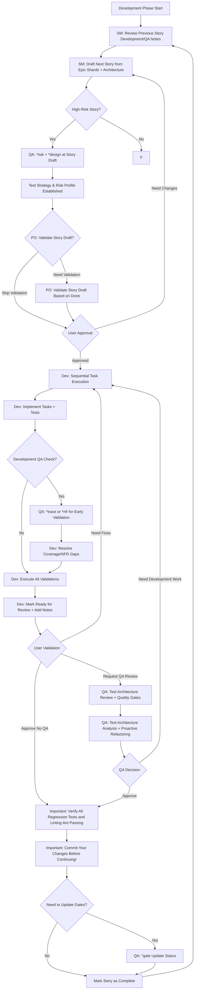

# Vibe Coding - BMad Method Development Guide

Vibe Coding is an example project demonstrating how to use BMad Method for structured agile development in Kilo Code.

## 🌐 Language Selection / 语言选择

- [繁體中文 (Traditional Chinese)](README.md)
- [简体中文 (Simplified Chinese)](README-zh-cn.md)
- [English](README-en.md)

## 📊 Project Statistics

[](https://github.com/bmadcode/bmad-method)
[](LICENSE)
[](https://discord.gg/gk8jAdXWmj)

**Project Status**: Active development 🚀
**Supported Languages**: JavaScript, TypeScript, Python, Java, C#, Go, etc.
**Supported IDEs**: Kilo Code, VS Code, Cursor, Windsurf, etc.

## 🚀 Why Choose BMad Method?

**BMad Method** is a revolutionary AI-driven development framework that combines:
- 🤖 **Intelligent Agent Collaboration** - Multi-role AI agents working together
- 📋 **Structured Processes** - Complete workflow from planning to delivery
- 🎯 **Quality Assurance** - Built-in testing strategies and quality gates
- 🔄 **Continuous Improvement** - Feedback-based iterative optimization

### Core Advantages
- **Boost Development Efficiency** - Reduce repetitive work, focus on creative tasks
- **Ensure Quality Consistency** - Standardized processes and checkpoints
- **Lower Communication Costs** - AI agents handle routine communications
- **Accelerate Learning Curve** - New members can quickly onboard standardized processes

## Quick Start

### 1. Install BMad Method

```bash
# Install BMad Method to your project
npx bmad-method install
```

After installation, you'll see:
- `.bmad-core/` - Core framework and agent files
- `docs/` - Architecture and story files directory (create yourself)
- `web-bundles/` - Pre-built web bundles

### 2. VS Code / Kilo Code Setup

To get the best BMad Method experience, install the following VS Code extensions:

#### Essential Extensions
- **Markdown All in One** - Markdown editing and preview
- **Markdown Preview Mermaid Support** - Flowchart support

#### Recommended Extensions
- **GitLens** - Git history and blame functionality
- **CodeStream** - Code reviews and discussions
- **Todo Tree** - TODO item tracking
- **Better Comments** - Enhanced comment functionality

#### Kilo Code Specific Settings
If you use Kilo Code, ensure:
1. Enable `@` symbol agent call functionality
2. Set appropriate mode switching (code, architect, qa, etc.)
3. Configure auto-save to avoid work loss

### 3. Understand Agent Roles

BMad Method provides the following agent roles:

| Agent | Role | When to Use |
|-------|------|-------------|
| **PM** | Product Manager | Create PRDs, define requirements |
| **Architect** | Architect | Design system architecture |
| **Dev** | Developer | Implement features and tests |
| **QA** | Test Architect | Quality assurance and testing strategies |
| **SM** | Scrum Master | Agile process management |
| **PO** | Product Owner | Validate and prioritize |
| **BMad-Master** | Multi-functional Agent | General task processing |

## Development Workflow

### Phase 1: Planning Phase (Planning Phase)



### Phase 2: Development Phase (Development Phase)



## Using BMad Method in Kilo Code

Kilo Code supports calling BMad agents using the `@` symbol:

### Basic Usage

```bash
# Create product requirements document
@pm Create a PRD for a task management app

# Design system architecture
@architect Design the system architecture for the task app

# Implement user authentication
@dev Implement user authentication with JWT tokens

# Quality assessment
@qa *review user-authentication-story
```

### Quality Gate Workflow

```bash
# Risk assessment (after story drafting)
@qa *risk user-authentication-story

# Test strategy design (after risk assessment)
@qa *design user-authentication-story

# Requirements tracing (during development)
@qa *trace user-authentication-story

# Non-functional requirements check
@qa *nfr user-authentication-story

# Complete quality assessment (after development)
@qa *review user-authentication-story

# Update quality gate status
@qa *gate user-authentication-story
```

## Reference File Structure

BMad Method uses the following standard file paths:

```
docs/
├── prd.md                    # Product Requirements Document
├── architecture.md           # System Architecture
├── epics/                    # Epic Shards
├── stories/                  # Epic Stories
└── qa/
    ├── assessments/          # QA Assessments
    └── gates/               # Quality Gates
```

## Example: Task Management App Development

Let's see how to develop a task management app using BMad Method:

### Step 1: Product Planning

```bash
@pm Create a comprehensive PRD for a task management application with the following features:
- User authentication and authorization
- Task creation, editing, and deletion
- Task categorization and prioritization
- Due date management
- User dashboard with task overview
- Team collaboration features
```

### Step 2: Architecture Design

```bash
@architect Design a scalable architecture for the task management app using:
- Frontend: React with TypeScript
- Backend: Node.js with Express
- Database: PostgreSQL
- Authentication: JWT
- Real-time updates: WebSocket
```

### Step 3: Quality Strategy

```bash
# Perform risk assessment on core features
@qa *risk user-authentication
@qa *design user-authentication

# Track during development
@qa *trace user-authentication
@qa *nfr user-authentication

# Final assessment
@qa *review user-authentication
```

### Step 4: Feature Implementation

```bash
@dev Implement user authentication with the following requirements:
- Email/password registration and login
- JWT token-based authentication
- Password reset functionality
- Secure password hashing
- Input validation and sanitization
```

## Best Practices

### Development Principles

1. **Small Steps Fast**：Break down large features into small, manageable stories
2. **Continuous Integration**：Frequently commit changes and run tests
3. **Quality First**：Perform QA assessments early in development
4. **Documentation Driven**：Use PRD and architecture as development guides
5. **Iterative Improvement**：Continuously improve based on QA feedback

### Agent Usage Suggestions

- **PM**: For requirements definition and priority setting
- **Architect**: For technical decisions and system design
- **Dev**: For code implementation and unit tests
- **QA**: For quality assurance and risk management
- **SM**: For process management and sprint planning
- **PO**: For acceptance criteria and business value validation

## Troubleshooting

### Common Issues

**Q: Installation failed?**
A: Ensure you have Node.js ≥ 18 and npm ≥ 9

**Q: Agent not responding?**
A: Check agent name spelling and necessary parameters

**Q: Quality gate rejected?**
A: Review QA's specific feedback and resolve issues

## 📚 Learning Resources & Community

### Advanced Reading
- [BMad Method User Guide](.bmad-core/user-guide.md) - Complete usage instructions
- [Architecture Standards](docs/architecture/coding-standards.md) - Coding standards
- [Testing Strategy](docs/architecture/testing-strategy.md) - Quality assurance
- [Definition of Done](docs/architecture/definition-of-done.md) - Delivery standards

### Community & Support
- **Discord Community**: [Join BMad Method Community](https://discord.gg/gk8jAdXWmj)
- **GitHub**: [Report Issues & Suggestions](https://github.com/bmadcode/bmad-method/issues)
- **YouTube**: [BMadCode Channel](https://www.youtube.com/@BMadCode)

### Advanced Topics
- **Customized Agents** - Adjust agent behavior based on project needs
- **Expansion Packs** - Game development, creative writing, etc. professional domain support
- **Enterprise Integration** - Best practices for large teams and enterprise environments
- **Performance Optimization** - Scaling strategies for large projects

## 🎯 Success Cases

### Applicable Scenarios
- **New Project Development** - Structured development from scratch
- **Existing Project Refactoring** - Introduce standardized processes
- **Team Collaboration** - Multi-role collaborative development
- **Quality Improvement** - Establish sustainable development standards

### Quantitative Benefits
- **40% Development Efficiency Increase** - Reduce repetitive work and communication costs
- **60% Error Rate Reduction** - Built-in quality checks and testing strategies
- **30% Delivery Time Reduction** - Standardized processes and automated tools
- **Team Satisfaction Increase** - Clear role division and expectation management

## 🚀 Get Started

1. **Install BMad Method**
2. **Read User Guide**
3. **Execute First Project**
4. **Join Community Share Experience**

---

*"BMad Method is not just a tool, but a development team's superpower. Let AI handle repetitive work, let humans focus on creativity."*

*BMad Method enhances your development processes without replacing your professional expertise.*