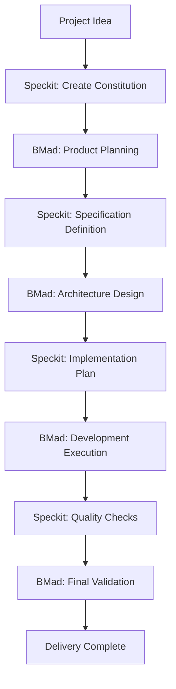

# BMad Method V6 Alpha and Speckit Integration Guide

**Version**: V6 Alpha (6.0.0-alpha.6)

## Overview

This guide explains how to effectively combine BMad Method V6 Alpha and Speckit in project development, providing a structured and efficient development process.

**Important Changes**: V6 Alpha uses workflow system (Workflow), command format is `*workflow-name`

## Integration Architecture



## Phase Details

### Phase 1: Project Initialization (Constitution Creation)

**Using Speckit:**
```bash
# Create project constitution
/speckit.constitution Create principles focused on code quality, testing standards, user experience consistency, and performance requirements
```

**BMad Method Support:**
- Constitution content aligns with BMad's quality standards
- Ensures all agents follow the same principles

### Phase 2: Product Planning (Requirements Definition)

**Using BMad Method V6 Alpha:**
```bash
# 1. Initialize workflow first (if new project)
*workflow-init

# 2. PM agent creates product requirements document
*prd
# Workflow will guide creating PRD with detailed user stories, acceptance criteria, and success metrics

# 3. UX Designer creates UX design (if project has UI)
*ux
# Workflow will guide creating wireframes and user journey maps
```

**Speckit Integration:**
- PRD content serves as the foundation for Speckit specifications
- Constitution ensures requirements definition meets quality standards

### Phase 3: Specification Definition (Spec-Driven)

**Using Speckit:**
```bash
# Convert requirements into detailed specifications
/speckit.specify Build the application based on the PRD created above. Include all user stories, technical requirements, and success criteria.

/speckit.clarify  # Clarify any ambiguous points if needed
```

**BMad Method Support:**
- Architect agent can assist with technical specification refinement
- QA agent can perform early evaluation of specification testability

### Phase 4: Architecture Design (System Design)

**Using BMad Method V6 Alpha:**
```bash
# Architect agent creates architecture document
*create-architecture
# Workflow will automatically read PRD and Epic files, create architecture based on Speckit specification
# Consider constitution principles and performance requirements

# Solutioning gate check (validate planning consistency)
*solutioning-gate-check
# Validate PRD, UX, Architecture, Epics are aligned
```

**Speckit Integration:**
- Architecture design serves as input for Speckit implementation plans
- Ensures architecture meets constitution-defined technical standards

### Phase 5: Implementation Planning (Task Decomposition)

**Using Speckit:**
```bash
# Create detailed implementation plan
/speckit.plan Define the technology stack, component structure, data models, and implementation approach based on the architecture.

/speckit.tasks  # Generate specific task list
```

**BMad Method Support:**
- Dev agent can assist with technology selection evaluation
- SM agent helps with task prioritization and sprint planning

### Phase 6: Quality Preparation (Testing Strategy)

**Using Speckit:**
```bash
# Create quality checklists
/speckit.checklist Create checklists for requirements, UX, performance, accessibility, and security
```

**Using BMad Method:**
```bash
# QA agent formulates detailed testing strategy
@qa *design Create comprehensive testing strategy for all user stories
@qa *risk Perform detailed risk assessment for high-priority features
```

### Phase 7: Development Execution (Implementation Phase)

**Using Speckit:**
```bash
# Execute automated implementation
/speckit.implement
```

**Using BMad Method:**
```bash
# Ongoing quality checks during development
@dev Implement features following TDD principles
@qa *trace Monitor requirement coverage during development
@qa *nfr Validate non-functional requirements
```

**Integration Workflow:**
1. Speckit generates code structure and basic implementations
2. Dev agent refines business logic and complex features
3. QA agent continuously validates quality gates
4. PO agent validates features meet business requirements

### Phase 8: Quality Verification (Testing and Validation)

**Using BMad Method:**
```bash
# Comprehensive quality assessment
@qa *review Perform comprehensive quality assessment
@qa *gate Update quality gate status

# PO validation
@po Validate that all acceptance criteria are met
```

**Speckit Integration:**
- Quality checklists ensure all requirements are met
- Constitution principles validate final delivery quality

### Phase 9: Delivery and Learning (Completion and Improvement)

**Using BMad Method:**
```bash
# Final validation and deployment preparation
@sm Review the completed work and prepare deployment
@architect Create deployment and operations documentation
```

## Best Practices

### 1. Constitution-First Principle
- All decisions comply with Speckit constitution
- BMad agents make decisions referencing the constitution

### 2. Specification-Driven Development
- Use Speckit specifications as development foundation
- BMad agents assist with technical implementation of specifications

### 3. Dual Quality Assurance
- Speckit checklists as baseline quality requirements
- BMad QA agents provide additional quality assurance

### 4. Continuous Integration
- Balance between Speckit's automation and BMad's manual processes
- Ensure consistent output between both tools

### 5. Documentation Synchronization
- Keep outputs from both tools synchronized
- Avoid version inconsistencies in documents

## Role Division

| Phase | Primary Tool | Supporting Tool | Main Outputs |
|-------|--------------|-----------------|--------------|
| Constitution Creation | Speckit | - | Project principles and standards |
| Product Planning | BMad | Speckit | PRD, user stories |
| Specification Definition | Speckit | BMad Architect | Detailed technical specifications |
| Architecture Design | BMad | Speckit | System architecture diagrams |
| Implementation Planning | Speckit | BMad Dev/SM | Task lists, checklists |
| Development Execution | Speckit | BMad QA | Code, tests |
| Quality Verification | BMad | Speckit | Quality reports |
| Delivery Deployment | BMad | - | Product delivery |

## Toolchain Integration

### Development Environment Setup
```bash
# Install Speckit
uv venv
source .venv/bin/activate
uv pip install -e .

# Install BMad Method
npx bmad-method@alpha install
```

### IDE Configuration
- Kilo Code: Enable `@` agent calls and Speckit commands
- VS Code: Install necessary extensions
- Configure auto-save and version control integration

### CI/CD Integration
- Speckit checklists as CI gates
- BMad QA agent test results integrated into CI pipeline
- Automated quality gate validation

## Common Issues Resolution

### Q: Overlapping responsibilities between Speckit and BMad Method?
A: Speckit focuses on specification definition and automated implementation, BMad Method provides intelligent agent collaboration and quality assurance. They complement each other.

### Q: How to handle specification changes?
A: Update Speckit specifications first, then use BMad agents to assess impact and adjust implementation plans.

### Q: What if quality gates are inconsistent?
A: Speckit checklists serve as minimum requirements, BMad QA agents can set stricter thresholds.

### Q: How to scale for large projects?
A: Use Speckit's modular specification structure combined with BMad Method's multi-agent collaboration.

## Quantitative Benefits

- **50% Development Efficiency Increase**: Speckit automation + BMad intelligent collaboration
- **70% Quality Consistency Increase**: Unified constitution + quality gates
- **40% Delivery Time Reduction**: Structured processes + automated tools
- **60% Maintenance Cost Reduction**: Specification-driven + test-first

## Summary

BMad Method and Speckit's integration provides a complete development ecosystem:
- **Speckit** ensures specification completeness and implementation consistency
- **BMad Method** provides intelligent agent collaboration and quality assurance
- **Integrated workflow** achieves efficient and reliable software delivery

This combined approach combines the efficiency of automated tools with the flexibility of intelligent agents for modern software development best practices.