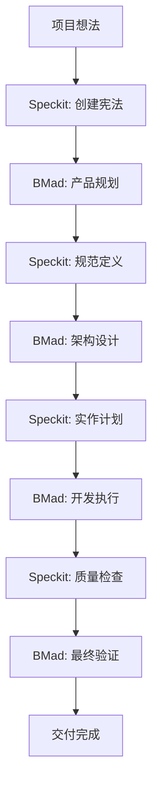

# BMad Method V6 Alpha 与 Speckit 整合指南

**版本**: V6 Alpha (6.0.0-alpha.6)

## 概述

本指南解释如何在项目开发过程中有效结合 BMad Method V6 Alpha 和 Speckit，提供结构化和高效的开发流程。

**重要变更**: V6 Alpha 使用工作流程系统（Workflow），指令格式为 `*workflow-name`

## 整合架构



## 阶段详解

### 阶段 1: 项目初始化 (宪法创建)

**使用 Speckit:**
```bash
# 创建项目宪法
/speckit.constitution Create principles focused on code quality, testing standards, user experience consistency, and performance requirements
```

**BMad Method 支持:**
- 宪法内容与 BMad 的质量标准对齐
- 确保所有代理遵循相同原则

### 阶段 2: 产品规划 (需求定义)

**使用 BMad Method V6 Alpha:**
```bash
# 1. 先初始化工作流程（如果是新项目）
*workflow-init

# 2. PM 代理创建产品需求文档
*prd
# 工作流程会引导创建 PRD，包含详细的用户故事、验收标准和成功指标

# 3. UX Designer 创建 UX 设计（如果项目有 UI）
*ux
# 工作流程会引导创建线框图和使用者旅程地图
```

**Speckit 整合:**
- PRD 内容作为 Speckit 规范的基础
- 宪法确保需求定义符合质量标准

### 阶段 3: 规范定义 (Spec-Driven)

**使用 Speckit:**
```bash
# 将需求转换为详细规范
/speckit.specify Build the application based on the PRD created above. Include all user stories, technical requirements, and success criteria.

/speckit.clarify  # 如需要澄清任何模糊点
```

**BMad Method 支持:**
- Architect 代理可以协助技术规范的完善
- QA 代理可以早期评估规范的测试可行性

### 阶段 4: 架构设计 (系统设计)

**使用 BMad Method V6 Alpha:**
```bash
# Architect 代理创建架构文档
*create-architecture
# 工作流程会自动读取 PRD 和 Epic 文件，基于 Speckit 规范创建架构
# 考量宪法原则和性能要求

# 方案门槛检查（验证规划一致性）
*solutioning-gate-check
# 验证 PRD、UX、Architecture、Epics 是否对齐
```

**Speckit 整合:**
- 架构设计作为 Speckit 实作计划的输入
- 确保架构符合宪法定义的技术标准

### 阶段 5: 实作计划 (任务分解)

**使用 Speckit:**
```bash
# 创建详细的实作计划
/speckit.plan Define the technology stack, component structure, data models, and implementation approach based on the architecture.

/speckit.tasks  # 生成具体任务清单
```

**BMad Method 支持:**
- Dev 代理可以协助技术选型的评估
- SM 代理协助任务优先顺序和冲刺规划

### 阶段 6: 质量准备 (测试策略)

**使用 Speckit:**
```bash
# 创建质量检查清单
/speckit.checklist Create checklists for requirements, UX, performance, accessibility, and security
```

**使用 BMad Method:**
```bash
# QA 代理制定详细测试策略
@qa *design Create comprehensive testing strategy for all user stories
@qa *risk Perform detailed risk assessment for high-priority features
```

### 阶段 7: 开发执行 (实作阶段)

**使用 Speckit:**
```bash
# 执行自动化实作
/speckit.implement
```

**使用 BMad Method V6 Alpha:**
```bash
# 1. 初始化冲刺规划（仅执行一次）
*sprint-planning

# 2. 创建故事
*create-story

# 3. 创建故事技术上下文（建议）
*story-context

# 4. 实作故事（遵循 TDD 原则）
*dev-story
# 工作流程会自动实作功能并包含测试

# 5. 代码审查（质量检查）
*code-review
# 包含完整的代码质量检查、测试覆盖率分析、NFR 验证
```

**整合工作流程:**
1. Speckit 生成代码结构和基本实作
2. Dev 代理完善商业逻辑和复杂功能
3. QA 代理持续验证质量门坎
4. PO 代理验证功能符合业务需求

### 阶段 8: 质量验证 (测试与验收)

**使用 BMad Method:**
```bash
# 完整质量评估
@qa *review Perform comprehensive quality assessment
@qa *gate Update quality gate status

# PO 验收
@po Validate that all acceptance criteria are met
```

**Speckit 整合:**
- 质量检查清单确保所有要求都已满足
- 宪法原则验证最终交付质量

### 阶段 9: 交付与学习 (完成与改进)

**使用 BMad Method:**
```bash
# 最终验证和部署准备
@sm Review the completed work and prepare deployment
@architect Create deployment and operations documentation
```

## 最佳实践

### 1. 宪法优先原则
- 所有决策符合 Speckit 宪法
- BMad 代理参考宪法进行决策

### 2. 规范驱动开发
- 使用 Speckit 规范作为开发基础
- BMad 代理协助规范的技术实现

### 3. 质量双重保障
- Speckit 检查清单作为基础质量要求
- BMad QA 代理提供额外质量保证

### 4. 持续整合
- Speckit 自动化与 BMad 手动流程的平衡
- 确保两个系统的输出保持一致

### 5. 文档同步
- Speckit 生成的规范与 BMad 代理建立的文件保持同步
- 避免文档版本不一致的问题

## 角色分工

| 阶段 | 主导工具 | 协作工具 | 主要产出 |
|------|----------|----------|----------|
| 宪法创建 | Speckit | - | 项目原则与标准 |
| 产品规划 | BMad | Speckit | PRD、用户故事 |
| 规范定义 | Speckit | BMad Architect | 详细技术规范 |
| 架构设计 | BMad | Speckit | 系统架构图 |
| 实作计划 | Speckit | BMad Dev/SM | 任务清单、检查清单 |
| 开发执行 | Speckit | BMad QA | 代码、测试 |
| 质量验证 | BMad | Speckit | 质量报告 |
| 交付部署 | BMad | - | 产品交付 |

## 工具链整合

### 开发环境设置
```bash
# 安装 Speckit
uv venv
source .venv/bin/activate
uv pip install -e .

# 安装 BMad Method
npx bmad-method@alpha install
```

### IDE 配置
- Kilo Code: 启用 `@` 代理调用和 Speckit 命令
- VS Code: 安装必要扩展功能
- 配置自动保存和版本控制整合

### CI/CD 整合
- Speckit 检查清单作为 CI 门坎
- BMad QA 代理的测试结果整合到 CI 流程
- 自动化质量门坎验证

## 常见问题解决

### Q: Speckit 与 BMad Method 的分工重叠？
A: Speckit 专注于规范定义和自动化实作，BMad Method 提供智慧代理协作和质量保证。两者相辅相成。

### Q: 如何处理规范变更？
A: 先更新 Speckit 规范，然后使用 BMad 代理评估影响并调整实作计划。

### Q: 质量门坎不一致怎么办？
A: Speckit 检查清单作为最低要求，BMad QA 代理可以设置更严格的门坎。

### Q: 大型项目如何扩展？
A: 使用 Speckit 的模块化规范结构，结合 BMad Method 的多代理协作模式。

## 效益量化

- **开发效率提升 50%**: Speckit 自动化 + BMad 智慧协作
- **质量一致性提升 70%**: 统一宪法 + 质量门坎
- **交付时间缩短 40%**: 结构化流程 + 自动化工具
- **维护成本降低 60%**: 规范驱动 + 测试优先

## 总结

BMad Method 与 Speckit 的整合提供了一个完整的开发生态系统：
- **Speckit** 确保规范完整性和实作一致性
- **BMad Method** 提供智慧代理协作和质量保证
- **整合流程** 实现高效、可靠的软件交付

这种搭配使用的方式结合了自动化工具的效率和智慧代理的灵活性，为现代软件开发提供了最佳实践框架。