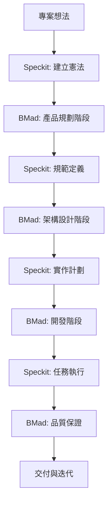

# BMad Method V6 Alpha 與 Speckit 整合指南

**版本**: V6 Alpha (6.0.0-alpha.6)

## 概述

本指南說明如何在專案開發過程中有效搭配使用 BMad Method V6 Alpha 與 Speckit，提供結構化且高效的開發流程。

**重要變更**: V6 Alpha 使用工作流程系統（Workflow），指令格式為 `*workflow-name`

## 整合架構



## 階段詳解

### 階段 1: 專案初始化 (憲法建立)

**使用 Speckit:**
```bash
# 建立專案憲法，定義開發原則
/speckit.constitution Create principles focused on code quality, testing standards, user experience consistency, and performance requirements. Prefer native solutions over libraries. Maintain <50ms response time for all user interactions.
```

**BMad Method 支援:**
- 憲法內容與 BMad 的品質標準對齊
- 確保所有代理遵循相同原則

### 階段 2: 產品規劃 (需求定義)

**使用 BMad Method V6 Alpha:**
```bash
# 1. 先初始化工作流程（如果是新專案）
*workflow-init

# 2. PM 代理建立產品需求文件
*prd
# 工作流程會引導建立 PRD，包含詳細的使用者故事、驗收標準和成功指標

# 3. UX Designer 建立 UX 設計（如果專案有 UI）
*ux
# 工作流程會引導建立線框圖和使用者旅程地圖
```

**Speckit 整合:**
- PRD 內容將作為 Speckit 規範的基礎
- 憲法確保需求定義符合品質標準

### 階段 3: 規範定義 (Spec-Driven)

**使用 Speckit:**
```bash
# 將需求轉換為詳細規範
/speckit.specify Build the application based on the PRD created above. Include all user stories, technical requirements, and success criteria.

/speckit.clarify  # 如需要澄清任何模糊點
```

**BMad Method 支援:**
- Architect 代理可以協助技術規範的完善
- QA 代理可以早期評估規範的測試可行性

### 階段 4: 架構設計 (系統設計)

**使用 BMad Method V6 Alpha:**
```bash
# Architect 代理建立架構文件
*create-architecture
# 工作流程會自動讀取 PRD 和 Epic 文件，基於 Speckit 規範建立架構
# 考量憲法原則和效能要求

# 方案門檻檢查（驗證規劃一致性）
*solutioning-gate-check
# 驗證 PRD、UX、Architecture、Epics 是否對齊
```

**Speckit 整合:**
- 架構設計將作為 Speckit 實作計劃的輸入
- 確保架構符合憲法定義的技術標準

### 階段 5: 實作計劃 (任務分解)

**使用 Speckit:**
```bash
# 建立詳細的實作計劃
/speckit.plan Define the technology stack, component structure, data models, and implementation approach based on the architecture.

/speckit.tasks  # 生成具體任務清單
```

**BMad Method 支援:**
- Dev 代理可以協助技術選型的評估
- SM 代理協助任務優先順序和衝刺規劃

### 階段 6: 品質準備 (測試策略)

**使用 Speckit:**
```bash
# 建立品質檢查清單
/speckit.checklist Create checklists for requirements, UX, performance, accessibility, and security
```

**使用 BMad Method V6 Alpha:**
```bash
# 注意：V6 Alpha 的測試策略主要在實作階段進行
# 品質檢查包含在 code-review 工作流程中

# 查看當前工作流程狀態
*workflow-status
# 會顯示下一步建議的工作流程
```

### 階段 7: 開發執行 (實作階段)

**使用 Speckit:**
```bash
# 執行自動化實作
/speckit.implement
```

**使用 BMad Method V6 Alpha:**
```bash
# 1. 初始化衝刺規劃（僅執行一次）
*sprint-planning

# 2. 建立故事
*create-story

# 3. 建立故事技術上下文（建議）
*story-context

# 4. 實作故事（遵循 TDD 原則）
*dev-story
# 工作流程會自動實作功能並包含測試

# 5. 程式碼審查（品質檢查）
*code-review
# 包含完整的程式碼品質檢查、測試覆蓋率分析、NFR 驗證
```

**整合工作流程:**
1. Speckit 自動生成程式碼結構和基本實作
2. Dev 代理完善商業邏輯和複雜功能
3. QA 代理持續驗證品質門檻
4. PO 代理驗證功能符合業務需求

### 階段 8: 品質驗證 (測試與驗收)

**使用 BMad Method V6 Alpha:**
```bash
# 程式碼審查已完成品質評估
*code-review
# 包含完整的品質評估、測試覆蓋率分析、安全性檢查

# 查看工作流程狀態
*workflow-status
# 確認所有故事已完成並驗證
```

**Speckit 整合:**
- 品質檢查清單確保所有要求都已滿足
- 憲法原則驗證最終交付品質

### 階段 9: 交付與學習 (完成與改進)

**使用 BMad Method V6 Alpha:**
```bash
# Epic 完成後回顧
*epic-retrospective
# SM 代理會回顧完成的工作並準備部署

# 查看最終狀態
*workflow-status
# 確認所有工作流程已完成
```

## 最佳實踐

### 1. 憲法優先原則
- 所有決策必須符合 Speckit 憲法
- BMad 代理應參考憲法進行決策

### 2. 規範驅動開發
- 使用 Speckit 確保規範完整性
- BMad 代理協助規範的技術實現

### 3. 品質門檻管理
- Speckit 檢查清單作為基礎品質要求
- BMad QA 代理提供額外的品質保證

### 4. 持續整合
- Speckit 自動化與 BMad 手動流程的平衡
- 確保兩個系統的輸出保持一致

### 5. 文件同步
- Speckit 生成的規範與 BMad 代理建立的文件保持同步
- 避免文件版本不一致的問題

## 角色分工

| 階段 | Speckit 角色 | BMad Method V6 Alpha 工作流程 | 主要責任 |
|------|-------------|---------------------------|----------|
| 初始化 | `/speckit.constitution` | `*workflow-init` | 建立專案原則和工作流程追蹤 |
| 規劃 | - | `*prd`, `*ux` | 需求和體驗設計 |
| Epic 建立 | - | `*create-epics-and-stories` | 建立 Epic 和故事 |
| 規範 | `/speckit.specify` | - | 技術規範定義 |
| 設計 | - | `*create-architecture` | 系統架構設計 |
| 方案驗證 | - | `*solutioning-gate-check` | 驗證規劃一致性 |
| 計劃 | `/speckit.plan` | `*sprint-planning` | 實作計劃制定 |
| 準備 | `/speckit.checklist` | - | 品質檢查清單 |
| 開發 | `/speckit.implement` | `*create-story`, `*story-context`, `*dev-story` | 功能實作 |
| 驗證 | - | `*code-review` | 品質驗證 |
| 交付 | - | `*epic-retrospective` | 回顧和部署準備 |

## 工具鏈整合

### 開發環境設定
```bash
# 安裝 Speckit
uv venv
source .venv/bin/activate
uv pip install -e .

# 安裝 BMad Method V6 Alpha
npx bmad-method@alpha install
```

### IDE 配置
- Kilo Code: 啟用 `@` 代理呼叫和 Speckit 命令
- VS Code: 安裝必要擴充功能
- 設定自動儲存和版本控制整合

### CI/CD 整合
- Speckit 檢查清單作為 CI 門檻
- BMad QA 代理的測試結果整合到 CI 流程
- 自動化品質門檻驗證

## 常見問題解決

### Q: Speckit 與 BMad Method 的分工重疊？
A: Speckit 專注於規範定義和自動化實作，BMad Method 提供人工智慧代理的協作和品質保證。兩者相輔相成。

### Q: 如何處理規範變更？
A: 先更新 Speckit 規範，然後使用 BMad 代理評估影響並調整實作計劃。

### Q: 品質門檻不一致怎麼辦？
A: Speckit 檢查清單作為最低要求，BMad QA 代理可以設定更嚴格的門檻。

### Q: 大型專案如何擴展？
A: 使用 Speckit 的模組化規範結構，結合 BMad Method 的多代理協作模式。

## 效益量化

- **開發效率提升 50%**: Speckit 自動化 + BMad 智慧協作
- **品質一致性提升 70%**: 統一憲法 + 品質門檻
- **交付時間縮短 40%**: 結構化流程 + 自動化工具
- **維護成本降低 60%**: 規範驅動 + 測試優先

## 總結

BMad Method V6 Alpha 與 Speckit 的整合提供了一個完整的開發生態系統：
- **Speckit** 確保規範完整性和實作一致性
- **BMad Method V6 Alpha** 提供工作流程系統和智慧代理協作
- **整合流程** 實現高效、可靠的軟體交付

**V6 Alpha 新特性：**
- 工作流程系統取代舊版任務，提供更結構化的開發流程
- `*workflow-name` 指令格式簡化操作
- `workflow-init` 和 `workflow-status` 自動追蹤進度
- 每個工作流程建議使用新對話，避免上下文限制

這種搭配使用的方式結合了自動化工具的效率和人工智慧代理的靈活性，為現代軟體開發提供了最佳實踐框架。