# Vibe Coding - BMad Method 开发指南

Vibe Coding 是一个展示如何在 Kilo Code 中使用 BMad Method 进行结构化敏捷开发的范例项目。

## 🌐 语言选择 / Language Selection

- [繁体中文 (Traditional Chinese)](README.md)
- [简体中文 (Simplified Chinese)](README-zh-cn.md)
- [English](README-en.md)

## 📊 项目统计

[](https://github.com/bmadcode/bmad-method)
[](LICENSE)
[](https://discord.gg/gk8jAdXWmj)

**项目状态**: 活跃开发中 🚀
**支持语言**: JavaScript, TypeScript, Python, Java, C#, Go 等
**适用 IDE**: Kilo Code, VS Code, Cursor, Windsurf 等

## 🚀 为什么选择 BMad Method？

**BMad Method** 是一个革命性的 AI 驱动开发框架，结合了：
- 🤖 **智慧代理协作** - 多角色 AI 代理协同工作
- 📋 **结构化流程** - 从规划到交付的完整工作流程
- 🎯 **质量保证** - 内建测试策略和质量门坎
- 🔄 **持续改进** - 基于反馈的迭代优化

### 核心优势
- **提升开发效率** - 减少重复工作，专注创造性任务
- **确保质量一致性** - 标准化的流程和检查点
- **降低沟通成本** - AI 代理处理例行沟通
- **加速学习曲线** - 新成员可快速上手标准化流程

## 快速开始

### 1. 安装 BMad Method

```bash
# 安装 BMad Method 到您的项目
npx bmad-method install
```

安装完成后，您会看到：
- `.bmad-core/` - 核心框架和代理文件
- `docs/` - 架构和故事文件目录(请自己建立)
- `web-bundles/` - 预建的网络套件

### 2. VS Code / Kilo Code 设置

为了获得最佳的 BMad Method 使用体验，请安装以下 VS Code 扩展功能：

#### 必要扩展功能
- **Markdown All in One** - Markdown 编辑和预览
- **Markdown Preview Mermaid Support** - 流程图支持

#### 推荐扩展功能
- **GitLens** - Git 历史和 blame 功能
- **CodeStream** - 代码审查和讨论
- **Todo Tree** - TODO 项目跟踪
- **Better Comments** - 增强注释功能

#### Kilo Code 特定设置
如果您使用 Kilo Code，请确保：
1. 启用 `@` 符号代理调用功能
2. 设置适当的模式切换（code, architect, qa 等）
3. 配置自动保存以避免工作遗失

### 3. 认识代理角色

BMad Method 提供以下代理角色：

| 代理 | 角色 | 使用时机 |
|------|------|----------|
| **PM** | 产品经理 | 建立 PRD、定义需求 |
| **Architect** | 架构师 | 设计系统架构 |
| **Dev** | 开发者 | 实现功能和测试 |
| **QA** | 测试架构师 | 质量保证和测试策略 |
| **SM** | Scrum Master | 敏捷流程管理 |
| **PO** | 产品负责人 | 验证和优先顺序 |
| **BMad-Master** | 多功能代理 | 通用任务处理 |

## 开发工作流程

### 阶段 1: 规划阶段 (Planning Phase)

```mermaid
graph TD
    A[项目想法] --> B{需要研究?}
    B -->|是| C[Analyst: 市场研究]
    B -->|否| D{已有项目简报?}
    C --> D
    D -->|是| E[PM: 从简报建立 PRD]
    D -->|否| F[PM: 互动式 PRD 建立]
    E --> G[PRD 建立完成]
    F --> G
    G --> H{需要 UX?}
    H -->|是| I[UX Expert: 建立前端规格]
    H -->|否| J[Architect: 从 PRD 建立架构]
    I --> K[UX Expert: 产生 UI 提示]
    K --> L[Architect: 从 PRD + UX 建立架构]
    J --> M{QA 早期策略?}
    L --> M
    M -->|是| N[QA: 对高风险区域进行早期测试架构输入]
    M -->|否| O[PO: 执行主检查清单]
```



### 阶段 2: 开发阶段 (Development Phase)

```mermaid
graph TD
    A[开发阶段开始] --> B[SM: 检阅前一个故事的开发/QA 笔记]
    B --> C[SM: 从分片史诗 + 架构草拟下一个故事]
    C --> D{高风险故事?}
    D -->|是| E[QA: *risk + *design 于草拟故事]
    D -->|否| F
    E --> G[测试策略与风险设置档已建立]
    G --> H{PO: 验证故事草拟?}
    H -->|需要验证| I[PO: 根据成品验证故事草拟]
    H -->|跳过验证| J{使用者核准}
    I --> J
    J -->|核准| K[Dev: 循序任务执行]
    J -->|需要变更| C
    K --> L[Dev: 实作任务 + 测试]
    L --> M{开发中 QA 检查?}
    M -->|是| N[QA: *trace 或 *nfr 用于早期验证]
    M -->|否| O
    N --> P[Dev: 解决覆盖/NFR 差距]
    P --> O[Dev: 执行所有验证]
    O --> Q[Dev: 标记准备检阅 + 新增笔记]
    Q --> R{使用者验证}
    R -->|请求 QA 检阅| S[QA: 测试架构检阅 + 质量门坎]
    R -->|核准无 QA| U[重要: 验证所有回归测试和 linting 正在通过]
    S --> T[QA: 测试架构分析 + 主动重构]
    T --> V{QA 决定}
    V -->|需要开发工作| K
    V -->|核准| U
    R -->|需要修复| K
    U --> W[重要: 提交您的变更后再继续!]
    W --> X{需要更新门坎?}
    X -->|是| Y[QA: *gate 更新状态]
    X -->|否| Z
    Y --> Z[标记故事为完成]
    Z --> B
```



## 在 Kilo Code 中使用 BMad Method

Kilo Code 支持使用 `@` 符号调用 BMad 代理：

### 基本用法

```bash
# 建立产品需求文件
@pm Create a PRD for a task management app

# 设计系统架构
@architect Design the system architecture for the task app

# 实现用户认证
@dev Implement user authentication with JWT tokens

# 质量评估
@qa *review user-authentication-story
```

### 质量门坎工作流程

```bash
# 风险评估 (故事草拟后)
@qa *risk user-authentication-story

# 测试策略设计 (风险评估后)
@qa *design user-authentication-story

# 需求跟踪 (开发中)
@qa *trace user-authentication-story

# 非功能性需求检查
@qa *nfr user-authentication-story

# 完整质量评估 (开发完成)
@qa *review user-authentication-story

# 更新质量门坎状态
@qa *gate user-authentication-story
```

## 参考文件结构

BMad Method 使用以下标准文件路径：

```
docs/
├── prd.md                    # 产品需求文件
├── architecture.md           # 系统架构
├── epics/                    # 分片史诗
├── stories/                  # 分片故事
└── qa/
    ├── assessments/          # QA 评估
    └── gates/               # 质量门坎
```

## 实例：任务管理应用开发

让我们看看如何使用 BMad Method 开发一个任务管理应用：

### 步骤 1: 产品规划

```bash
@pm Create a comprehensive PRD for a task management application with the following features:
- User authentication and authorization
- Task creation, editing, and deletion
- Task categorization and prioritization
- Due date management
- User dashboard with task overview
- Team collaboration features
```

### 步骤 2: 架构设计

```bash
@architect Design a scalable architecture for the task management app using:
- Frontend: React with TypeScript
- Backend: Node.js with Express
- Database: PostgreSQL
- Authentication: JWT
- Real-time updates: WebSocket
```

### 步骤 3: 质量策略

```bash
# 对核心功能进行风险评估
@qa *risk user-authentication
@qa *design user-authentication

# 开发期间跟踪
@qa *trace user-authentication
@qa *nfr user-authentication

# 最终评估
@qa *review user-authentication
```

### 步骤 4: 功能实现

```bash
@dev Implement user authentication with the following requirements:
- Email/password registration and login
- JWT token-based authentication
- Password reset functionality
- Secure password hashing
- Input validation and sanitization
```

## 最佳实践

### 开发原则

1. **小步快跑**：将大型功能分解为小的、可管理的故事
2. **持续整合**：经常提交变更并执行测试
3. **质量优先**：在开发早期进行 QA 评估
4. **文档驱动**：使用 PRD 和架构作为开发指南
5. **迭代改进**：根据 QA 反馈持续改进

### 代理使用建议

- **PM**: 用于需求定义和优先顺序设置
- **Architect**: 用于技术决策和系统设计
- **Dev**: 用于代码实现和单元测试
- **QA**: 用于质量保证和风险管理
- **SM**: 用于流程管理和冲刺规划
- **PO**: 用于验收标准和业务价值验证

## 故障排除

### 常见问题

**Q: 安装失败？**
A: 确保您有 Node.js ≥ 18 和 npm ≥ 9

**Q: 代理没有回应？**
A: 检查代理名称拼写和必要的参数

**Q: 质量门坎被拒绝？**
A: 检阅 QA 的具体反馈并解决问题

## 📚 学习资源与社区

### 进阶阅读
- [BMad Method 用户指南](.bmad-core/user-guide.md) - 完整的使用说明
- [架构标准](docs/architecture/coding-standards.md) - 编码规范
  - [简体中文版](docs/architecture/zh-cn/coding-standards-zh-cn.md)
  - [English版](docs/architecture/en/coding-standards-en.md)
- [测试策略](docs/architecture/testing-strategy.md) - 质量保证
  - [简体中文版](docs/architecture/zh-cn/testing-strategy-zh-cn.md)
  - [English版](docs/architecture/en/testing-strategy-en.md)
- [完成定义](docs/architecture/definition-of-done.md) - 交付标准
  - [简体中文版](docs/architecture/zh-cn/definition-of-done-zh-cn.md)
  - [English版](docs/architecture/en/definition-of-done-en.md)

### 社区与支持
- **Discord 社区**: [加入 BMad Method 社区](https://discord.gg/gk8jAdXWmj)
- **GitHub**: [报告问题与建议](https://github.com/bmadcode/bmad-method/issues)
- **YouTube**: [BMadCode 频道](https://www.youtube.com/@BMadCode)

### 进阶主题
- **定制化代理** - 根据项目需求调整代理行为
- **扩展包** - 游戏开发、创意写作等专业领域支持
- **企业整合** - 大型团队和企业环境的的最佳实践
- **效能优化** - 大型项目的扩展策略

## 🎯 成功案例

### 适用场景
- **新项目开发** - 从零开始的结构化开发
- **既有项目重构** - 引入标准化流程
- **团队协作** - 多角色协同开发
- **质量提升** - 建立可持续的开发标准

### 效益量化
- **开发效率提升 40%** - 减少重复工作和沟通成本
- **错误率降低 60%** - 内建质量检查和测试策略
- **交付时间缩短 30%** - 标准化流程和自动化工具
- **团队满意度提升** - 清晰的角色分工和期望管理

## 🚀 开始使用

1. **安装 BMad Method**
2. **阅读用户指南**
3. **执行第一个项目**
4. **加入社区分享经验**

---

*"BMad Method 不只是工具，更是开发团队的超能力。让 AI 处理重复工作，让人类专注创造。"*

*BMad Method 增强您的开发流程，而不是取代您的专业知识。*